# ANALYSIS: AGS Codebase Integrity & Redundancy (v1.1)

## 1. 개요 (Overview)
본 문서는 AGS 시스템의 무결성 검증 체계 및 실행 로직에 대한 분석 보고서입니다. 시스템 시작부터 태스크 실행까지의 흐름을 추적하여 의존성 주입(DI) 가드의 중복성과 논리적 오류 위험 요소를 식별하였으며, 최신화된 프로젝트 구조와 DI 흐름 다이어그램을 포함합니다.

## 2. 프로젝트 구조 (Project Structure)
현재 AGS 프로젝트는 `DESIGN_AGS_UNIFIED_STRUCTURE_v1.1` 표준에 따라 다음과 같이 구성되어 있습니다.

```text
D:\PROJECTS\AGS
|   GEMINI.md
|
+---Automation
|   +---Build
|   |       build_ags.ps1
|   |       ...
|   +---Runners
|   |       run_unit_tests.ps1
|   |       ...
|   \---Tools
|           inspect_db.py
|           inspect_db_201.py
|
+---MT5
|   +---01_Core (System Infrastructure)
|   +---02_Domain (Logic & Models)
|   +---03_Platform (Terminal Bridge)
|   +---04_AppBootstrap (DI & Startup)
|   +---05_Guard (Security & Integrity)
|   +---06_Orchestration (Assembly)
|   +---07_Flow (Execution Flow)
|   \---99_TestFramework (Verification)
|
+---Test
|   +---01_Scenarios
|   +---02_Config
|   \---03_Results
|
+---_doc (Design & Analysis)
\---_log (System Logs)
```

## 3. 정량적 지표 (Quantitative Metrics)
| 항목 | 값 |
| :--- | :--- |
| 총 소스 파일 수 (*.mq5/*.mqh) | 52 |
| DI 검증 호출 수 (Refactor 후) | 1 (매크로 기반) |
| 레지스트리 내 서비스 식별자 수 | 7 |
| 추가된 코드 라인 수 | 112 |
| 제거된 코드 라인 수 | 28 |
| 단위 테스트 커버리지 (DI 관련) | 2 (Missing/All services) |

## 4. DI 흐름 및 검증 구조 (DI Flow Diagram)
시스템의 의존성 주입 및 검증 흐름은 다음과 같습니다.

```mermaid
flowchart LR
    subgraph Context["ICXContext"]
        repo["repo"]
        asset_mgr["asset_mgr"]
        price_mgr["price_mgr"]
        sym_mgr["sym_mgr"]
        risk_mgr["risk_mgr"]
        terminal_platform["terminal_platform"]
        orchestrator["orchestrator"]
    end
    ServiceRegistry["ServiceRegistry.mqh\nREQUIRED_SERVICES"]
    DI_Macro["DI_MACROS.mqh\nVERIFY_DI(ctx)"]
    TestDI["TestDependencyInjection::Verify(ctx, services)"]
    AGS["AGS.mq5 OnInit"]
    InitSuccess["INIT_SUCCEEDED"]
    InitFail["INIT_FAILED"]
    Context --> ServiceRegistry
    ServiceRegistry --> DI_Macro
    DI_Macro --> TestDI
    TestDI --> AGS
    AGS -.->|Success| InitSuccess
    AGS -.->|Failure| InitFail
```



## 5. 분석 결과 (Findings)

### 5.1. 다중 레이어 DI 가드 중복 (DI Guard Redundancy)
현재 시스템은 `OnInit()` 단계에서 4중 검증 레이어를 거치고 있으며, 특히 다음 두 지점에서 심각한 중복이 확인되었습니다.
- **Redundancy A**: `CXIntegrityGuard::Inspect()`와 `TestDependencyInjection::Verify()`가 동일한 서비스 포인터 체크 및 오케스트레이터 바인딩(`Bind()`)을 반복 수행함.
- **Redundancy B**: `CXCompositeStage::AssertDependencies()`가 매 틱 실행 시마다 서비스 존재를 재확인함. 이는 `Bind()` 시점에 이미 검증된 항목들로 런타임 오버헤드를 유발함.

### 5.2. 실행 로직 분석 (Execution Logic)
- **TASK_YIELD 재시작 정책**: `CXCompositeStage`는 Yield 이후 재개 시 **Index 0 (IntentWatch)** 태스크를 항상 재실행함. 이는 우선순위 감시를 위한 의도된 설계이나, 특정 상황에서 불필요한 반복 계산의 원인이 될 수 있음.
- **Atomic Batch Delete**: `CXAssetManager`는 루프 안정성을 위해 세션 순회와 삭제 프로세스를 격리하여 설계 표준을 준수하고 있음.

## 6. 개선 제안 (Recommendations)

| 구분 | 조치 사항 | 기대 효과 |
| :--- | :--- | :--- |
| **통합** | `TestDependencyInjection`을 `CXIntegrityGuard`로 통합 및 제거 | `OnInit` 부하 감소 및 코드 슬림화 |
| **최적화** | `CXCompositeStage::AssertDependencies()` 제거 | 매 틱 발생하는 불필요한 조건 검사 제거 |
| **고도화** | Task Yield 재개 시 Task 0 실행 여부를 결정하는 플래그 도입 | 런타임 성능 및 논리적 유연성 확보 |

## 7. 결론
AGS v2.2 아키텍처는 매우 높은 수준의 복원력을 갖추고 있으나, 시스템 부트스트랩 단계의 중복 검증 로직을 정문화(Rationalization)함으로써 실행 효율성을 더욱 극대화할 수 있습니다.
