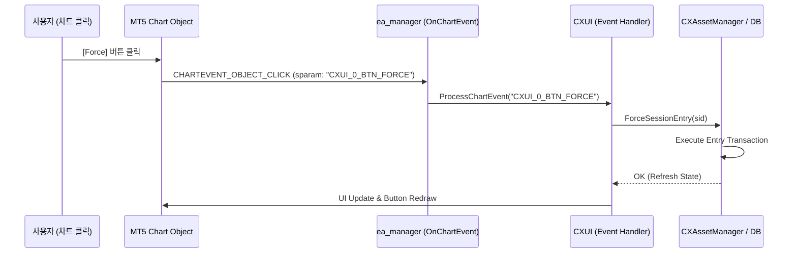
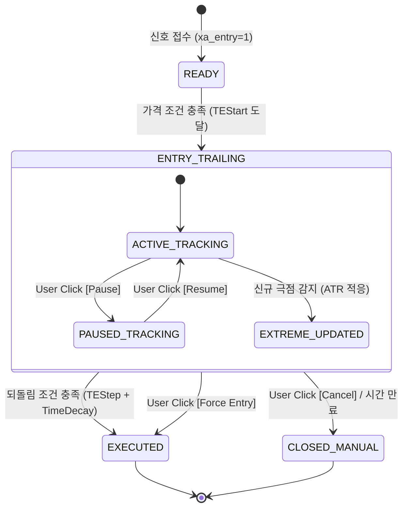

# DESIGN_AGS_CXUI_및_추적_진입_알고리즘_고도화_설계서_v1.0.md

## Document History
- **v1.0** (2026-06-03) CXUI 대시보드 HUD 고도화 및 인터랙티브 컨트롤 추가, ATR 기반 변동성 적응형 추적(Adaptive TE) 및 시간 감쇄(Time-Decay) 알고리즘 설계를 포함한 초안 작성

---

## 1. 개요 및 배경

AGS(Anti-Gravity System) MQL5 엔진은 신호 진입 및 청산 과정에서 지연을 최소화하고 유리한 진입 가격을 확보하기 위해 **추적 진입(Trailing Entry, TE)** 알고리즘을 사용합니다. 또한 이를 모니터링하기 위해 **CXUI** 차트 시각화 레이어를 통해 실시간 진행 상황을 차트 상에 표시해 왔습니다.

그러나 현재 구현된 시스템에는 다음과 같은 고도화 요구사항이 존재합니다:
1. **단순 텍스트 기반 CXUI의 시각적/인터랙티브 한계**: 현재 CXUI는 단순히 텍스트 라벨 객체(`CChartObjectLabel`)를 세로로 나열하는 방식입니다. 추적 진입 과정의 '되돌림(Rebound) 진행도'가 직관적이지 않으며, 차트 상에서 즉각적으로 특정 진입 세션을 중단하거나 강제 진입시킬 수 있는 버튼 등의 컨트롤러가 부재합니다.
2. **정적(Static) 추적 진입 알고리즘의 경직성**: 현재 TE/TS 알고리즘의 되돌림 판단 폭(`TEStep`)은 정수 포인트 값으로 고정되어 있습니다. 이로 인해:
   - 고변동성 장세(지표 발표 등)에서는 틱 노이즈에 의해 쉽게 진입 조건이 트리거되는 조기 진입 현상이 발생합니다.
   - 저변동성 장세에서는 설정된 Step 가격에 도달하지 못해 진입 기회를 완전히 놓치는 현상이 발생합니다.
   - 가격이 진입 조건(Start)을 터치한 후 반대 방향으로 계속 흘러갈 때, 시간 경과(Time Decay)에 따른 유연한 진입 유도가 불가능합니다.
   - 순간적인 스프레드 확대나 틱 스파이크(Tick Spike)에 의해 극점(`TE_Extreme`)이 비정상적으로 깊게 설정되면, 이후 시장가격이 되돌아오지 않아 영원히 진입하지 못하는 '극점 락(Extreme Lock)' 위험이 있습니다.

본 설계서는 이러한 한계를 극복하기 위해 **1) HUD 레이아웃 개선 및 버튼 입력 제어를 포함하는 CXUI 고도화**와 **2) 변동성 적응(ATR) 및 시간 감쇄(Time-Decay) 모델을 적용한 추적 진입 알고리즘 고도화** 방안을 제시합니다.

---

## 2. CXUI 대시보드 및 컨트롤러 고도화 설계

새로운 CXUI는 MetaTrader 5 차트 상에서 전문 트레이딩 콘솔 느낌을 주는 HUD(Heads-Up Display) 카드로 재설계되며, 마우스 클릭으로 개별 세션을 직접 제어할 수 있는 인터랙티브 컨트롤 버튼을 탑재합니다.

### 2.1 HUD 레이아웃 및 게이지 시각화
기존의 2줄 텍스트 출력을 탈피하여, 테이블 그리드와 진행 게이지(Progress Bar)를 포함한 카드 구조로 확장합니다.

```
+---------------------------------------------------------------------------------------------------+
| [▶ BUY] CNO4-26060314-01-01  |  [ENTRY TR]*  | ADV: +14.5 pt  | Progress: [██████░░░░] 60%        |
|  ┗━ BASE: 2350.00 | EXT: 2342.50 | CURR: 2345.50 | STEP: 5.0 pt   | [Pause] [Force] [Cancel]           |
+---------------------------------------------------------------------------------------------------+
```

- **방향 및 SID**: BUY/SELL 성격에 따른 테마 색상(BUY: `clrDodgerBlue`, SELL: `clrTomato`) 적용 및 트레일링 활성화 상태(`▶`) 표시.
- **상태 배지(Status Badge)**: `[READY]`, `[ENTRY TR]`, `[STOP TR]`, `[ACTIVE]` 등 현재 세션 상태를 명확히 구조화된 대괄호 또는 배경색이 포함된 라벨로 구분.
- **되돌림 진행 게이지(Rebound Progress Gauge)**: 극점(`Extreme`)으로부터 되돌림 가격(`CurrentPrice`)이 목표 단계(`TEStep`)에 도달한 비율을 10단계 텍스트 바(`[██████░░░░] 60%`)로 실시간 시각화.
  $$\text{Progress \%} = \min\left(100\%, \frac{\text{|CurrentPrice - Extreme|}}{\text{TEStep} \times \text{Point}} \times 100\right)$$
- **Advantage(개선 가격) 지표**: 최초 감지 가격(Discovery Market Price) 대비 현재 추적 중인 가격(또는 진입 완료 가격)의 차이를 포인트 단위로 환산하여, 시스템이 확보한 가격 이점을 실시간 출력 (`ADV: +14.5 pt`).

### 2.2 차트 인터랙티브 컨트롤 버튼 (Clickable GUI)
MQL5의 `CChartObjectButton`을 사용하여 개별 슬롯의 하단 또는 우측에 3개의 제어 버튼을 배치합니다.

1. **[Pause / Resume] 버튼**:
   - 클릭 시 해당 세션의 트레일링 상태를 일시 정지(Pause)시킵니다.
   - 일시 정지 시 극점 갱신 및 되돌림 평가가 유예되며, 버튼 텍스트가 `[Resume]`으로 토글되고 노란색(`clrGold`) 테두리로 강조됩니다.
2. **[Force] 버튼**:
   - 현재 되돌림 조건 충족 여부와 관계없이 즉시 시장가 진입을 강제 집행(Force Market Entry)합니다.
   - 해당 세션의 평가 단계를 생략하고 즉시 `ExecuteEntry` 트랜잭션을 트리거합니다.
3. **[Cancel] 버튼**:
   - 해당 진입 세션을 즉시 취소하고 관련 대기 주문을 브로커 서버에서 삭제하며 DB 상태를 `XE_CLOSED_MANUAL`로 종료 마킹합니다.

#### 차트 이벤트 핸들링 구조
차트 상에서의 버튼 클릭 이벤트(`CHARTEVENT_OBJECT_CLICK`)를 감지하여 비즈니스 로직으로 라우팅하는 핸들러를 `ea_manager.mqh` 및 `CXAppService::Pulse`와 연계합니다.



---

## 3. 추적 진입(Trailing Entry) 알고리즘 고도화 설계

변동성이 극심하게 변하는 실시간 시장 환경에서 최적의 진입점을 안정적으로 확보하기 위해, 수학적 모델 기반의 적응형 알고리즘을 도입합니다.

### 3.1 변동성 적응형 단계 (Volatility-Adaptive Step)
고정된 `TEStep` 대신 시장의 최근 변동성(ATR 또는 Standard Deviation)을 실시간으로 반영하여 적응형 되돌림 폭(Adaptive Step)을 산출합니다.

- **산출 공식**:
  $$TEStep_{adaptive} = TEStep_{base} \times \left(1.0 + \alpha \times \frac{ATR(14) - ATR_{median}}{ATR_{median}}\right)$$
  - $TEStep_{base}$: 신호 정보에 입력된 기본 되돌림 포인트 수.
  - $ATR(14)$: 현재 차트 타임프레임의 14기간 평균 실질 변동폭(Average True Range)을 포인트 단위로 환산한 값.
  - $ATR_{median}$: 최근 120개 캔들 동안의 ATR 중앙값(Base Volatility Reference).
  - $\alpha$: 변동성 민감도 파라미터 (기본값: `0.5`).
  - **안전 하한 및 상한 제한 (Bounding Guard)**:
    $$0.5 \times TEStep_{base} \le TEStep_{adaptive} \le 2.5 \times TEStep_{base}$$

- **효과**: 변동성이 평소보다 커지면 진입을 시도하는 되돌림 폭($TEStep_{adaptive}$)이 확장되어 틱 노이즈에 의한 조기 진입을 방지하고 깊은 되돌림을 끝까지 추적합니다. 반대로 거래량이 죽은 횡보장에서는 되돌림 폭이 축소되어 빠른 진입을 보장합니다.

### 3.2 시간 감쇄 감속기 (Time-Decay Accelerator)
트레일링 진입이 활성화된 후 진입하지 못하고 시간이 너무 길어지면, 시장 추세가 진입 기회를 주지 않고 멀어질 가능성이 높아집니다. 경과 시간에 따라 되돌림 조건을 선형 또는 지수적으로 완화하여 진입 성공률을 높입니다.

- **산출 공식 (Linear Time-Decay Model)**:
  $$TEStep_{decayed}(t) = TEStep_{adaptive} \times \max\left(\beta, \ 1.0 - \frac{t}{T_{decay\_limit}}\right)$$
  - $t$: 트레일링 진입 활성화(`XE_ENTRY_TRAILING` 상태 진입) 이후 경과 시간 (초 단위).
  - $T_{decay\_limit}$: 최대 감쇄 제한 시간 (기본값: `300`초).
  - $\beta$: 최소 유지 비율 (기본값: `0.3`, 원래 Step의 30% 미만으로는 줄어들지 않음).

- **효과**: 5분이 경과할 때까지 되돌림이 발생하지 않으면, 요구되는 되돌림 폭이 원래의 30% 수준까지 감소하여 아주 미세한 반등만 나와도 시장가 진입을 트리거합니다.

```
Step Ratio (%)
100% |------------\
     |             \  <- Time Decay Begins
 30% |              \---------------------- (Beta Floor)
     +---------------------------------------> Time (t)
     0            60s                     300s
```

### 3.3 틱 스파이크 필터 및 극점 평활화 (Spike Filter & Extreme Smoothing)
비유동성 시기나 브로커 스프레드 순간 확대에 의한 단일 틱 스파이크가 극점(`TE_Extreme`)으로 기록되어 진입 장벽이 불합리하게 높아지는 현상을 제어합니다.

- **극점 업데이트 규칙 개선**:
  - 실시간 Tick의 Bid/Ask 가격을 그대로 극점으로 수용하지 않고, 최근 $N$개 틱(예: 5틱)의 중간값(Median Price) 또는 특정 이평선을 기준으로 극점 갱신 여부를 판정합니다.
  - 또는 극점 갱신 후 즉시 되돌림 평가를 진행하지 않고 최소 2틱 이상의 연속된 지지/저항 확인을 거친 후 극점을 확정합니다.

### 3.4 고도화된 되돌림 보호 장치 (Graduated Rebound Guard)
기존의 Rebound Guard는 가격이 원래의 신호 기준가(`baseline`)를 역전하면 즉시 강제 진입시켰습니다. 이는 진입 이점을 살리지 못하고 고점에서 매수하는 문제를 초래할 수 있습니다.
- **개선안**:
  - 가격이 `baseline`에 근접할 때, 해당 시점의 모멘텀 지표(RSI 또는 단기 이평선 교차)를 확인합니다.
  - 강한 역추세 모멘텀이 유지되고 있다면 강제 진입을 유예하고, 모멘텀이 감속하거나 되돌아설 때 진입을 triggering하는 2차 조건(Graduated Guard)을 구현합니다.

---

## 4. 아키텍처 연계 및 데이터 전이 매트릭스

고도화된 구성요소들은 기존의 `CXAppService`, `CXUI`, `CXTaskTrail` 계층에 정합하게 통합됩니다.

### 4.1 상태 전이 매트릭스 (State Transition Matrix)
수동 일시정지 및 강제 진입 제어가 추가된 새로운 상태 다이어그램입니다.



### 4.2 시스템 클래스 변경점 (Component Changes)

#### 1) [MODIFY] `CXUI` ([CXUI.mqh](file:///d:/Projects/AGS/MT5/01_Core/UI/CXUI.mqh))
- **역할**: 차트 렌더링 카드 구조 추가, 진행 상태바(Progress Bar) 출력 유틸리티 탑재.
- **인터랙티브 기능**: `CChartObjectButton` 인스턴스를 슬롯당 3개씩 동적 생성(`Initialize`), 일시 정지/강제/취소 버튼 생성 및 클릭 이벤트 수신 이벤트 핸들러 `OnChartEvent()` 인터페이스 구현.
- **최적화**: 상태 변화(상태 코드, 극점 가격, 진행도)가 발생했을 때만 제한적으로 `ChartRedraw()`를 호출하도록 그리드 데이터 버퍼링 구현.

#### 2) [MODIFY] `CXTaskTrail_V_Extremum` ([CXTaskTrail_V_Extremum.mqh](file:///d:/Projects/AGS/MT5/07_Flow/Tasks/Trailing/CXTaskTrail_V_Extremum.mqh))
- **역할**: 틱 스파이크 필터(최근 5개 틱 미디언 값 적용)가 통합된 극점 갱신 로직 구현.
- **서비스 의존성**: `ATR` 지표 핸들 획득을 위해 `ICXSymbolManager` 또는 새로운 지표 매니저 의존성 추가.

#### 3) [MODIFY] `CXTaskTrail_L_Evaluate` ([CXTaskTrail_L_Evaluate.mqh](file:///d:/Projects/AGS/MT5/07_Flow/Tasks/Trailing/CXTaskTrail_L_Evaluate.mqh))
- **역할**: ATR 기반 적응형 단계($TEStep_{adaptive}$) 연산 로직 추가.
- **시간 감쇄**: 트레일링 시작 시간(DB의 `xe_status`가 `ENTRY_TRAILING`으로 변경된 시점)을 기준으로 경과 시간 $t$를 산출하고 선형 시간 감쇄 비율을 적용한 $TEStep_{decayed}$ 도출.
- **수동 제어 플래그 확인**: 사용자 클릭 이벤트에 의해 설정된 `TE_Paused_{sid}` 파라미터가 `1`일 경우 즉시 `TASK_CONTINUE`를 반환하여 상태 전이를 동결.

---

## 5. 검증 및 테스트 계획

### 5.1 시나리오 기반 단위 테스트 (Unit Tests)
`99_TestFramework\UnitTests\Trailing_Stage` 디렉토리에 고도화 알고리즘에 대응하는 유닛 테스트 클래스를 추가하거나 확장합니다.

- **변동성 적응형 단계 테스트**:
  - ATR 값을 가상으로 주입하는 Mock 객체를 통해, ATR이 정상 범위일 때와 폭등했을 때 산출되는 되돌림 임계점($TEStep_{adaptive}$)이 의도한 한계선 내에서 정상적으로 확장/축소되는지 확인.
- **시간 감쇄 테스트**:
  - 가짜 시간 경과를 발생시키는 가상 클럭 모델(또는 `ITimeProvider` 개념)을 활용하여, 트레일링 시작 후 0초, 60초, 180초, 300초 경과 시점에 따라 되돌림 트리거가 점진적으로 낮은 rebound 폭에서도 발동하는지 검증.
- **버튼 제어 유닛 테스트**:
  - 차트 버튼 클릭 시 발행되는 객체명 문자열 토큰을 모방하여 `CXAppService::Pulse`에 전달하고, 세션 상태가 즉시 `PAUSE` 상태로 동결되거나 `Force` 진입하여 시장가 주문이 성공적으로 들어가는지 확인.

### 5.2 표준 테스트 환경 가이드라인 (`RULE[GEMINI.md]` 준수)
- **대상 심볼**: `GOLD#` (표준 심볼 사용)
- **테스트 계정**: `Login: 315136196`, `Password: xmDemo@2025`
- **로그인 보호**: 테스트 수행 전 MetaEditor/MT5 터미널의 기존 계정 연결 정보를 안전하게 백업 및 복원.
- **빌드 방식**: 빌드는 항상 자동 실행하지 않고, 설계 승인 후 사용자의 명시적인 동의 하에 `AGS\build.ps1`을 사용해 수동으로 수행할 것.

---

## 6. 오픈 질문 (Open Questions)

> [!IMPORTANT]
> 1. **버튼 입력 오작동 방지 가드**: 사용자가 차트의 버튼을 실수로 더블 클릭하거나 연속해서 누를 경우 발생하는 중복 주문/취소 에러를 예방하기 위해, 클릭 후 최소 1.5초 동안은 버튼의 클릭 이벤트를 무시하는 **버튼 쓰로틀링(Throttling) 가드**의 추가가 필요할까요?
> 2. **차트 버튼 렌더링 위치 설정**: 현재 차트의 오프셋 기준(`m_x_offset = 20`, `m_y_offset = 60`)을 바탕으로 슬롯 하단에 버튼을 나란히 그리는 방식이 좋을지, 아니면 화면 우측 영역에 별도의 '제어 패널(Side Control Panel)'을 모아 그리는 방식 중 선호하시는 UI 배치 구조가 있으신가요?
