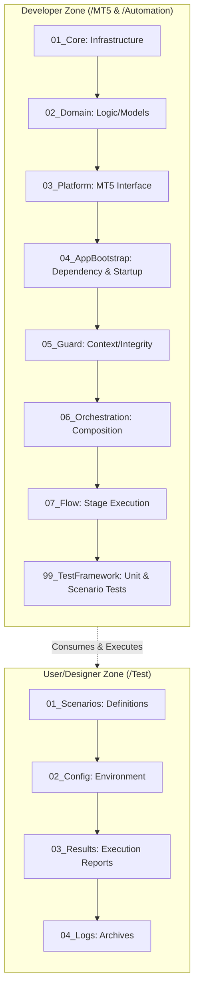

# DESIGN: AGS Unified Project Structure (v1.1)

## Document History
| Version | Date | Description | Author |
| :--- | :--- | :--- | :--- |
| v1.0 | 2026-05-30 | Initial Dual-Zone Architecture design. | System |
| v1.1 | 2026-05-30 | Added git worktree strategy, AI model workflow phases, and Mermaid diagrams. | System |

## 1. Overview
This document defines the finalized project structure for AGS, employing a Dual-Zone Architecture and Lifecycle-Based Numbering. It ensures clear ownership between developers and designers while making the system's execution flow intuitive.

**AI Model Execution Strategy**:
- **Phase 1 (Gemini Flash 4.5 High / 3.5 Flash High)**: Rapid relocation of files into the new structure. The primary goal is to achieve a syntax-error-free build after the fundamental structural reorganization. (Completed)
- **Phase 2 (Gemini Pro/Advanced)**: Deep verification of logical structures, business rules, dependency injection, and guard processing logic. (In Progress)

## 2. Core Architecture

### Architecture Diagram

### 2.1. Developer Zone (Infrastructure & Logic)
Located in `/MT5/` and `/Automation/`. It follows a strict dependency flow from `01` to `99`.

| Folder | Level | Name | Responsibility |
| :--- | :--- | :--- | :--- |
| `01_Core` | System | Infrastructure | Low-level utilities (DB, Log, ID, Interfaces, Macros, UI). |
| `02_Domain` | Logic | Domain Model | Trading rules and data models (SID, Signal). |
| `03_Platform` | Bridge | MT5 Interface | Terminal execution, price, risk, symbol, execution, session, and watcher. |
| `04_AppBootstrap` | Start | App Control | Dependency injection and AppService startup (includes `AGS.mq5`). |
| `05_Guard` | Verify | Security | Context verification and Integrity protection. |
| `06_Orchestration` | Assembly | Design | Composition of Sequences and Stages. |
| `07_Flow` | Execution | Flow | SID-lifecycle based Stage (01-07) execution. |
| `99_TestFramework` | Test | Verification | Developer-side unit and scenario test runners, mocks, and test cases. |

### 2.2. User/Designer Zone (Data & Config)
Located in `/Test/`. It follows a sequential usage flow from `01` to `04`.

| Folder | Level | Name | Responsibility |
| :--- | :--- | :--- | :--- |
| `01_Scenarios` | Design | Scenarios | Trading scenario definitions (JSON/TSDL). |
| `02_Config` | Control | Environment | MT5/Broker configuration files (INI). |
| `03_Results` | Output | Reports | Test outcome summaries and DB snapshots. |
| `04_Logs` | Archive | Logs | System execution log archives. |

## 3. Implementation Roadmap
1. **Preparation**: Create physical directory structure. (Completed)
2. **Worktree Setup**: Initialize git worktree to preserve existing code. (Completed)
3. **Migration (Phase 1)**: Move files from old hierarchy to numbered folders and fix include paths to ensure a successful build without syntax errors. (Completed)
4. **Validation (Phase 2)**: Execute full test suite, verify logic, dependency injection, and guard processing. (In Progress)

## 4. Version Control & Restoration Strategy (Git Worktree)
To guarantee stability during the extensive folder restructuring, a `git worktree` strategy was employed.
- **Objective**: Preserve existing implemented code and maximize reusability. The massive folder changes carry a high risk of breaking dependencies.
- **Method**: 
    - The main repository remained stable.
    - A dedicated `git worktree` (`d:/Projects/AGS-refactor`) was created for branch `refactor-v2-structure`.
    - All file relocations and path refactoring (Phase 1) occurred within the isolated worktree.
    - After verification, the branch was merged back into `main` and the worktree was pruned.
    - This guaranteed that the original functional state could be restored instantly at any time simply by switching back or referencing the main repository.

## 5. Test Framework Structure
The `99_TestFramework` contains:
- `/Mocks`: Mock objects and stubs used strictly for isolated testing (e.g., MockTerminalPlatform).
- `/Scenarios`: MQL5 test scenario loaders, TSDL parsers, and virtual pricer helpers.
- `/UnitTests`: MQL5 unit test scripts testing individual components (e.g., TestPVBIntegrity, TestTrailingEntry).
