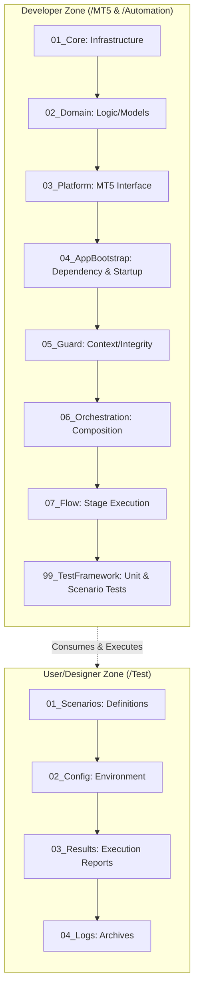
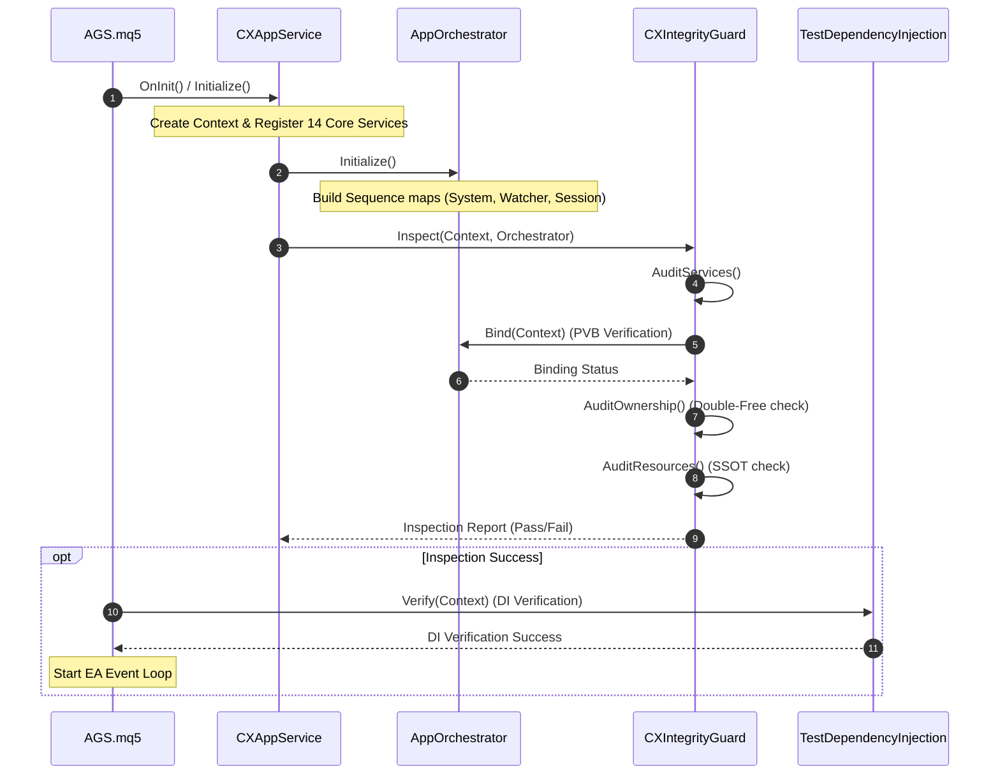

# DESIGN: AGS Unified Project Structure (v1.2)

## Document History
| Version | Date | Description | Author |
| :--- | :--- | :--- | :--- |
| v1.0 | 2026-05-30 | Initial Dual-Zone Architecture design. | System |
| v1.1 | 2026-05-30 | Added git worktree strategy, AI model workflow phases, and Mermaid diagrams. | System |
| v1.2 | 2026-05-30 | Centralized AppBootstrap/DI audits in Guard, cleaned up Orchestrator redundancy, and minimized runtime Flow checks. | System |

## 1. Overview
This document defines the finalized project structure for AGS, employing a Dual-Zone Architecture and Lifecycle-Based Numbering. It ensures clear ownership between developers and designers while making the system's execution flow intuitive.

## 2. Core Architecture

### Architecture Diagram

### 2.1. Developer Zone (Infrastructure & Logic)
Located in `/MT5/` and `/Automation/`. It follows a strict dependency flow from `01` to `99`.

| Folder | Level | Name | Responsibility |
| :--- | :--- | :--- | :--- |
| `01_Core` | System | Infrastructure | Low-level utilities (DB, Log, ID, Interfaces, Macros, UI). |
| `02_Domain` | Logic | Domain Model | Trading rules and data models (SID, Signal). |
| `03_Platform` | Bridge | MT5 Interface | Terminal execution, price, risk, symbol, execution, session, and watcher. |
| `04_AppBootstrap` | Start | App Control | Dependency injection and AppService startup (includes `AGS.mq5`). |
| `05_Guard` | Verify | Security | Context verification and Integrity protection. |
| `06_Orchestration` | Assembly | Design | Composition of Sequences and Stages. |
| `07_Flow` | Execution | Flow | SID-lifecycle based Stage (01-07) execution. |
| `99_TestFramework` | Test | Verification | Developer-side unit and scenario test runners, mocks, and test cases. |

### 2.2. User/Designer Zone (Data & Config)
Located in `/Test/`. It follows a sequential usage flow from `01` to `04`.

| Folder | Level | Name | Responsibility |
| :--- | :--- | :--- | :--- |
| `01_Scenarios` | Design | Scenarios | Trading scenario definitions (JSON/TSDL). |
| `02_Config` | Control | Environment | MT5/Broker configuration files (INI). |
| `03_Results` | Output | Reports | Test outcome summaries and DB snapshots. |
| `04_Logs` | Archive | Logs | System execution log archives. |

---

## 3. AppBootstrap & Guard Phase Verification Standard

To maximize execution efficiency and structural reliability, AGS employs a **Pre-Flight Guard Verification** model instead of repeating verification logic during runtime.

### 3.1. Bootstrap & Guard Sequence
The initialization order is modified to perform the Guard checks immediately after Orchestrator graph generation, ensuring a clean, fully validated startup sequence:

### 3.2. Verification Checklist
`CXIntegrityGuard` performs a multi-stage audit at boot time:
1. **Service Registration Audit**: Confirms all 14 core services are successfully created and registered in the `globalCtx`.
2. **Structural Binding Test (Pre-Validated Binding - PVB)**: Instructs the Orchestrator to compile all registered sequences and verify that every stage can successfully bind to its dependencies.
3. **Ownership Conflict Scan**: Scans all registered objects in the context to detect key overlapping and prevent double-free crashes.
4. **Singleton Resource (SSOT) Audit**: Audits resource usage to guarantee that only a single Database instance is shared across the platform.

### 3.3. Orchestration Redundancy Cleanup
Redundant verification code and recursive state checks are completely removed from `/MT5/06_Orchestration/` builders and sequence registers. The Orchestrator focuses strictly on registry graph definition and building the static state-to-stage mappings.

### 3.4. Runtime Validation Minimization in Execution Flow
Since the `IntegrityGuard` guarantees the existence of all services and validity of bindings during bootstrap, files under `/MT5/07_Flow/` (Stages, Sequences, Tasks, Functions) maintain a high-performance execution path. Redundant `IS_VALID` or type checks for critical context resources on every pulse/tick are minimized, ensuring minimum latency.

---

## 4. Implementation Roadmap
1. **Preparation**: Create physical directory structure. (Completed)
2. **Migration (Phase 1)**: Move files from old hierarchy to numbered folders and fix include paths to ensure a successful build without syntax errors. (Completed)
3. **Verification refactoring (Phase 2)**: 
   - Refactor `06_Orchestration` to remove redundant validation.
   - Centralize AppBootstrap and DI checks inside `05_Guard` (`CXIntegrityGuard`).
   - Run verification in `04_AppBootstrap` immediately after orchestrator mapping completion.
4. **Validation (Phase 2)**: Execute full test suite to confirm structural and logic integrity. (Pending Approval)
