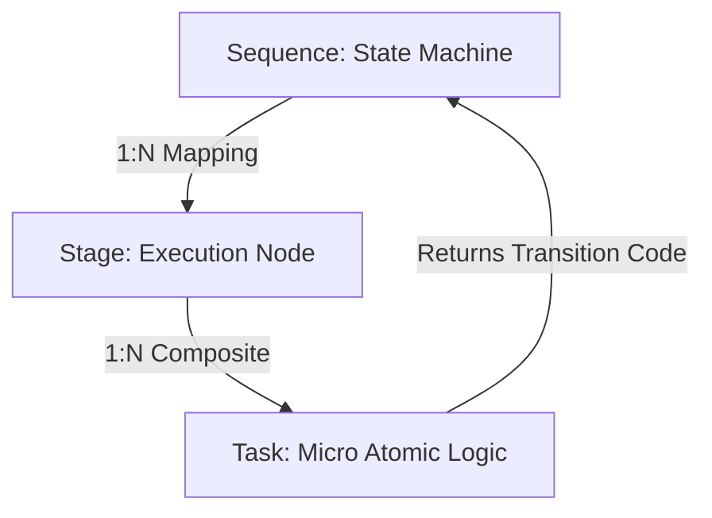
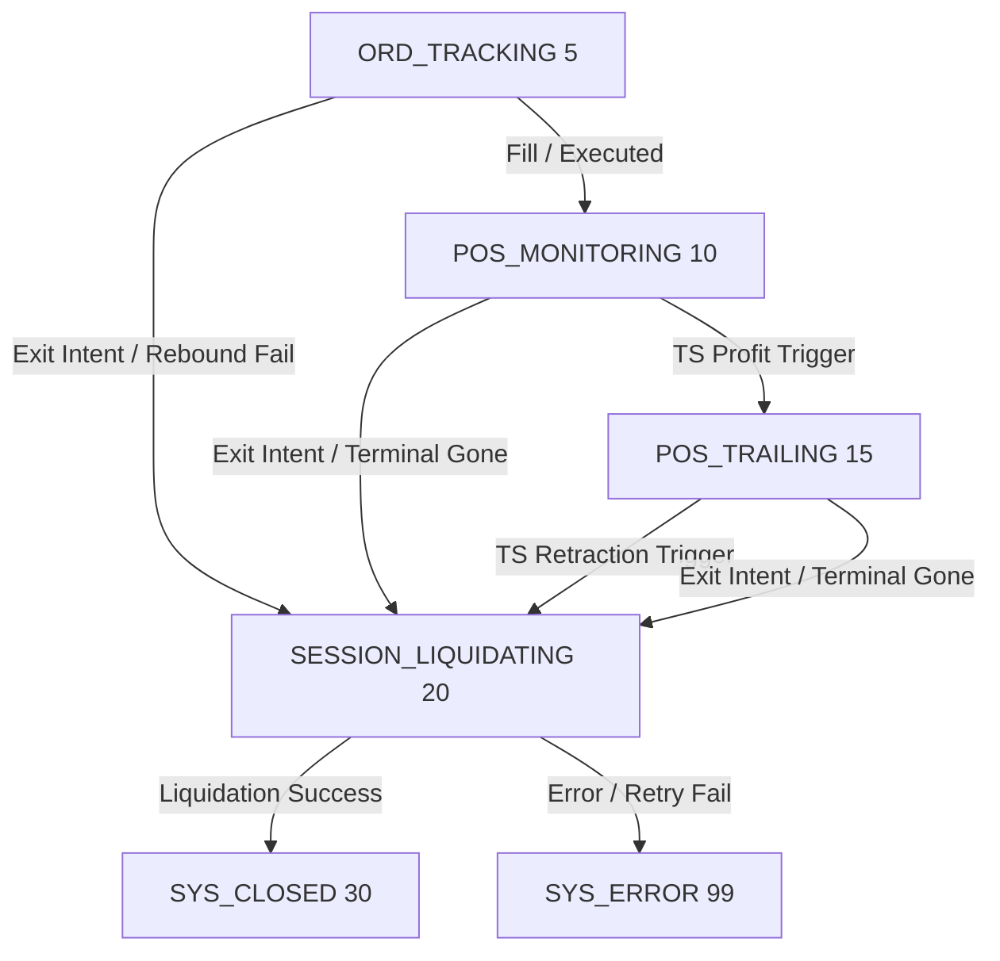

# [Design] AGS Stage, Sequence, Task Reference Call Matrix (v1.0)

**Status**: Approved  
**Author**: Antigravity  
**Target**: AGS (Asset Governance System) Workflow Engine의 시퀀스, 스테이지, 태스크 간 상호 참조 관계 및 상태 전이 메커니즘 도큐멘테이션.

---

## 1. 개요 (Overview)

AGS(Asset Governance System)는 복잡한 비즈니스 로직과 비동기식 브로커 트레이딩 환경을 제어하기 위해 **시퀀스-스테이지-태스크(Sequence-Stage-Task)**로 구조화된 **Hyper-Atomic Workflow 아키텍처**를 사용합니다.

- **시퀀스 (Sequence)**: 상태 머신(State Machine) 역할을 수행하며, `CXFluentSequence` 엔진이 펄스(Pulse) 마다 현재 상태(State ID)에 바인딩된 스테이지를 트리거합니다.
- **스테이지 (Stage)**: 단일 책임을 갖는 실행 노드입니다. 복합 스테이지인 `CXCompositeStage`는 내부에 여러 개의 마이크로 태스크(Task)를 순차 체인으로 조립하여 실행합니다.
- **태스크 (Task)**: 인터페이스 `IXTask`를 구현한 최소 단위 비즈니스 로직입니다. 각 태스크는 실행 결과에 따라 다음 태스크 진행(`TASK_CONTINUE`), 실행 중단(`TASK_BREAK`), 비차단 대기(`TASK_YIELD`), 혹은 특정 상태 ID(양수)를 반환하여 시퀀스의 상태 전이를 즉각 유도합니다.

---

## 2. 상태 코드 및 레지스트리 매핑 (Registry Mapping)

`AppOrchestrator`와 `CXDefine.mqh`에 명시된 주요 워크플로 상태 코드 매핑 정보는 다음과 같습니다.

| 기호명 (Symbolic Name) | 정수값 (Numeric ID) | 설명 (Description) |
| :--- | :--- | :--- |
| **SYS_BOOTSTRAP** | `999` | 시스템 기동 초기화(Bootstrap) 상태 |
| **WATCHER_ENTRY_DISCOVERY** | `1000` | 신규 진입 신호(xa_entry=1) 탐색 상태 |
| **WATCHER_ENTRY_EXECUTE** | `1001` | 발견된 진입 신호에 대한 물리 오더 송신 상태 |
| **WATCHER_EXIT_DISCOVERY** | `1002` | 청산 요청 신호(xa_exit=1) 탐색 상태 |
| **WATCHER_EXIT_EXECUTE** | `1003` | 발견된 청산 신호에 대한 물리 청산 송신 상태 |
| **ORD_TRACKING** (ORD_TRAILING) | `5` | 대기 주문 트레일링(진트: TE) 감시 및 상태 관리 상태 |
| **POS_MONITORING** (POS_ACTIVE) | `10` | 진입 완료 포지션 감시 및 트레일링(익트: TS) 조건 감시 상태 |
| **POS_TRAILING** (POS_TRAILING) | `15` | 익절 트레일링(익트: TS) 활성화 후 극점 가격 추격 상태 |
| **SESSION_LIQUIDATING** | `20` | 물리 자산 청산(Close/Cancel) 집행 및 DB 락/상태 갱신 상태 |
| **SYS_CLOSED** (SESSION_CLOSED) | `30` | 세션 완전 종료 및 이관 준비 상태 |
| **SYS_ERROR** (SESSION_ERROR) | `99` | 예외 발생 및 타임아웃/오류 처리 터미널 상태 |

---

## 3. 시퀀스별 참조 매트릭스 (Sequence Call Matrix)

### A. 시스템 공통 시퀀스 (System Sequence: `m_system_map`)
시스템 기동 및 구성 환경을 검증하는 단발성 부트스트랩 파이프라인입니다.

| 소스 상태 (From State) | 실행 스테이지 (Stage Type / Alias) | 태스크 체인 (Tasks) | 성공 전이 (`?`) | 실패 전이 (`!`) |
| :--- | :--- | :--- | :--- | :--- |
| **SYS_BOOTSTRAP** (`999`) | `SystemSetup`  (`CXStageSystemSetup`) | *없음 (단일 게이트웨이 스테이지)* | **WATCHER_ENTRY_DISCOVERY** (`1000`) | **SYS_ERROR** (`99`) |

---

### B. 워처 파이프라인 시퀀스 (Watcher Sequence: `m_watcher_map`)
DB 신규 진입/청산 명령을 스캔하여 `AssetManager`에 집행을 위임하는 백그라운드 데몬 시퀀스입니다.

| 소스 상태 (From State) | 실행 스테이지 (Stage Type / Alias) | 성공 전이 (`?`) | 실패 전이 (`!`) | 기능 요약 (Flow Summary) |
| :--- | :--- | :--- | :--- | :--- |
| **WATCHER_ENTRY_DISCOVERY** (`1000`) | `EntryDiscovery`  (`CXStageEntryDiscovery`) | **WATCHER_ENTRY_EXECUTE** (`1001`) | **WATCHER_EXIT_DISCOVERY** (`1002`) | 신규 진입 신호(`xa_entry=1`, `xe_status < 10`) 탐색 후 Context에 `"entry_signals"` 저장. |
| **WATCHER_ENTRY_EXECUTE** (`1001`) | `EntryExecute`  (`CXStageEntryExecute`) | **WATCHER_EXIT_DISCOVERY** (`1002`) | **WATCHER_EXIT_DISCOVERY** (`1002`) | Context의 `"entry_signals"` 목록을 추출하여 `asset_mgr.ExecuteEntry()` 위임 및 리스트 일괄 메모리 해제. |
| **WATCHER_EXIT_DISCOVERY** (`1002`) | `ExitDiscovery`  (`CXStageExitDiscovery`) | **WATCHER_EXIT_EXECUTE** (`1003`) | **WATCHER_ENTRY_DISCOVERY** (`1000`) | 청산 요청 신호(`xa_exit=1`, `xe_status < 20`) 탐색 후 Context에 `"exit_signals"` 저장. |
| **WATCHER_EXIT_EXECUTE** (`1003`) | `ExitExecute`  (`CXStageExitExecute`) | **WATCHER_ENTRY_DISCOVERY** (`1000`) | **WATCHER_ENTRY_DISCOVERY** (`1000`) | 신호 개수 5개 이상 시 Bulk Magic Sweep 수행. 각 신호 `asset_mgr.ExecuteExit()` 실행 및 DB 최종 갱신. |

---

### C. 자산 세션 시퀀스 (Session Sequence: `m_session_map`)
개별 자산 세션이 생성된 후 소멸할 때까지 생애 주기를 제어하는 핵심 트레이딩 워크플로입니다.  
모든 스테이지는 복합형(`CXCompositeStage`)으로 빌드되며 내부에 고유한 마이크로 태스크 체인을 순서대로 실행합니다.

#### C-1. 대기 주문 관리 스테이지 (`ORD_TRACKING` / ID: `5`)
- **매핑 스테이지**: `Stage_OrderOptimization` (Composite)
- **컨스트레인트**: Timeout 300초, Retries 0회
- **태스크 구성 및 흐름**:

| 실행 순서 | 태스크 식별자 (Task ID) | 구체 클래스 (Class Name) | 실행 상세 및 반환 결과 (Execution Details & Result) |
| :---: | :--- | :--- | :--- |
| **1** | `TASK_A_INTENT_WATCH` | `CXTaskIntentWatch` | **(필수 감시)** 수동 주문 취소 감지 시 `SESSION_CLOSED(30)` 반환.  외부 DB 청산 요청 감지 시 `SESSION_LIQUIDATING(20)` 즉각 반환. |
| **2** | `TASK_T_V_ACTIVATE_TE` | `CXTaskTrail_V_Activate` | **[TE 활성화]** BUY 기준 가격이 `Open - te_start` 이하로 떨어질 시 `TE_Active_{SID}=1` 마킹. |
| **3** | `TASK_T_V_EXTREMUM_TE` | `CXTaskTrail_V_Extremum` | **[진트 극점]** 활성화 상태에서 실시간 가격 중 최극점(BUY: 최저가, SELL: 최고가)을 갱신 및 기록. |
| **4** | `TASK_T_L_EVALUATE_TE` | `CXTaskTrail_L_Evaluate` | **[진트 반등]** 현재가와 극점 간의 반등 거리 검증. `distance >= step` 만족 시 `xp.SetInt(10)` 전이 준비 코드 설정. |
| **5** | `TASK_T_R_EXECUTE_TE` | `CXTaskTrail_R_Execute` | **[진트 실행]** 전이 코드 `10` 확인 시 기존 대기 주문 삭제 후 즉시 시장가 진입(`ORDER_MARKET`) 실행. |
| **6** | `TASK_P_V_SYNC` | `CXTaskPending_V_Sync` | **[실물 동기화]** 터미널 내 대기 오더가 체결되어 포지션으로 전환되었을 경우 `SESSION_ACTIVE(10)` 반환.  티켓 미생성 시 `TASK_BREAK` 반환하여 흐름 차단. |
| **7** | `TASK_A_V_STALE` | `CXTaskSync_V_Stale` | **[좀비 롤백]** `XE_PENDING_REQ` 상태로 5분 이상 정체 시 `XE_READY`로 백오프 후 `TASK_BREAK` 반환. |

---

#### C-2. 활성 포지션 감시 스테이지 (`POS_MONITORING` / ID: `10`)
- **매핑 스테이지**: `Stage_PositionGovernance` (Composite)
- **컨스트레인트**: Timeout 3600초, Retries 0회
- **태스크 구성 및 흐름**:

| 실행 순서 | 태스크 식별자 (Task ID) | 구체 클래스 (Class Name) | 실행 상세 및 반환 결과 (Execution Details & Result) |
| :---: | :--- | :--- | :--- |
| **1** | `TASK_A_INTENT_WATCH` | `CXTaskIntentWatch` | **(필수 감시)** 수동 청산 감지 시 직권으로 `xe_status=24(CLOSED_MANUAL)` 및 `xa_exit=2` 마킹 후 `SESSION_CLOSED(30)` 즉각 반환.  외부 청산 요청 시 `SESSION_LIQUIDATING(20)` 반환. |
| **2** | `TASK_T_V_ACTIVATE_TS` | `CXTaskTrail_V_Activate` | **[TS 활성화]** 평가 수익이 `ts_start` 포인트 이상 도달 시 `TS_Active_{SID}=1` 마킹 후 **`SESSION_TRAILING_STOP(15)`** 즉각 전이 코드 반환. |
| **3** | `TASK_A_V_TERMINAL` | `CXTaskActive_V_Terminal` | **[실물 검증]** 터미널 실물 포지션 존재 여부 확인 후 결과를 `xp.SetInt(0 또는 1)`에 저장. |
| **4** | `TASK_A_P_ALIGN` | `CXTaskActive_P_Align` | **[DB 동기화]** 실물이 유실(Absence)되었고 DB가 열려있는 경우, 브로커 SL/TP 히트로 간주하여 DB 정렬 후 `TASK_CONTINUE`. |

---

#### C-3. 포지션 익절 트레일링 스테이지 (`POS_TRAILING` / ID: `15`)
- **매핑 스테이지**: `Stage_PositionTrailing` (Composite)
- **컨스트레인트**: Timeout 3600초, Retries 0회
- **태스크 구성 및 흐름**:

| 실행 순서 | 태스크 식별자 (Task ID) | 구체 클래스 (Class Name) | 실행 상세 및 반환 결과 (Execution Details & Result) |
| :---: | :--- | :--- | :--- |
| **1** | `TASK_A_INTENT_WATCH` | `CXTaskIntentWatch` | **(필수 감시)** 수동 청산 감지 시 `SESSION_CLOSED(30)` 반환.  외부 청산 요청 시 `SESSION_LIQUIDATING(20)` 반환. |
| **2** | `TASK_T_V_EXTREMUM_TS` | `CXTaskTrail_V_Extremum` | **[익트 극점]** 활성화 상태에서 평가 이익의 최극점(BUY: 최고가, SELL: 최저가)을 실시간으로 추적 및 기록. |
| **3** | `TASK_T_L_EVALUATE_TS` | `CXTaskTrail_L_Evaluate` | **[익트 되돌림]** 극점 대비 가격 되돌림 폭 검증. `distance >= step` 만족 시 `xp.SetInt(20)` 전이 준비 코드 설정. |
| **4** | `TASK_T_R_EXECUTE_TS` | `CXTaskTrail_R_Execute` | **[익트 실행]** 되돌림 트리거 로깅 수행 후 전이 코드 `20` 전파 (다음 태스크 진행). |
| **5** | `TASK_A_V_TERMINAL` | `CXTaskActive_V_Terminal` | **[실물 검증]** 포지션 유효성 확인 및 결과를 `xp`에 기록. |
| **6** | `TASK_A_P_ALIGN` | `CXTaskActive_P_Align` | **[DB 동기화]** 실물 소멸 시 DB 강제 정렬 처리. |

---

#### C-4. 자산 청산 실행 스테이지 (`SESSION_LIQUIDATING` / ID: `20`)
- **매핑 스테이지**: `Stage_PositionLiquidation` (Composite)
- **컨스트레인트**: Timeout 300초, Retries 3회
- **태스크 구성 및 흐름**:

| 실행 순서 | 태스크 식별자 (Task ID) | 구체 클래스 (Class Name) | 실행 상세 및 반환 결과 (Execution Details & Result) |
| :---: | :--- | :--- | :--- |
| **1** | `TASK_A_INTENT_WATCH` | `CXTaskIntentWatch` | **(필수 감시)** 실물 포지션이 이미 소멸된 경우 `SESSION_CLOSED(30)` 즉시 반환하여 중복 청산 절차 우회. |
| **2** | `TASK_X_L_PREPARE` | `CXTaskExit_L_Prepare` | **[청산 준비]** 이미 완료된 신호(`>= XE_CLOSED_SIGNAL`)일 경우 `SESSION_CLOSED(30)` 반환. |
| **3** | `TASK_X_P_LOCK` | `CXTaskExit_P_Lock` | **[DB 선점 락]** DB에 청산 진입 중("Intent: Liquidation Requesting...")을 기록. 실패 시 `TASK_YIELD`로 재시도. |
| **4** | `TASK_X_R_ORDER` | `CXTaskExit_R_Order` | **[청산 오더]** `exit_mgr.SweepBySid()` 호출하여 브로커에 실제 청산 주문 송신. 성공 시 `xp.SetInt(3)` 저장.  브로커 오프라인 또는 리젝 시 `TASK_YIELD` 반환 (30초 타임아웃 제한). |
| **5** | `TASK_X_V_ERROR` | `CXTaskExit_V_Error` | **[에러 검증]** 지속적인 청산 오류로 인해 타임아웃 발생 시 `SESSION_ERROR(99)` 반환하여 강제 에러 종료. |
| **6** | `TASK_X_V_TERMINAL` | `CXTaskExit_V_Terminal` | **[자산 소멸 검증]** 터미널 내 물리 자산이 완벽히 사라졌는지 L3 검증 수행. 미소멸 시 `TASK_YIELD` (최대 5회) 후 실패 시 `SESSION_ERROR(99)` 전이. |
| **7** | `TASK_X_P_FINALIZE` | `CXTaskExit_P_Finalize` | **[DB 최종 확정]** DB 상태를 `XE_CLOSED_SIGNAL` 및 `xa_exit=2(XA_CLOSED_COMPLETED)`로 최종 영속화. 완료 시 **`SESSION_CLOSED(30)`** 반환하여 전체 세션 종료. |

---

## 4. Hyper-Atomic 제어 흐름 및 설계 원칙

1. **OnCondition 비진입성**: 복합 스테이지(`CXCompositeStage`)의 `OnCondition()`은 항시 `true`를 반환하도록 설계되며, 분기 및 조건 필터링은 개별 태스크의 `Execute()` 단계 내부에서 완전히 처리하는 것을 원칙으로 합니다.
2. **Yield & Resume (틱간 상태 저장)**: `TASK_YIELD` 반환 시, 복합 스테이지는 Context의 `CompositeIndex_{StageName}`에 해당 태스크 인덱스를 영속적으로 캐싱합니다. 다음 틱(Pulse)이 트리거되면 시퀀스는 `startIndex`부터 다시 실행하지만, `TASK_A_INTENT_WATCH` (인덱스 `0`)은 외부 강제 중단 및 수동 처리를 실시간으로 인터셉트하기 위해 **인덱스 저장값과 무관하게 항상 매 틱 최우선 실행**됩니다.
3. **Inclusive Trailing Evaluation (`>=`)**: `GEMINI.md` 규격에 의거하여, `CXTaskTrail_V_Activate` 및 `CXTaskTrail_L_Evaluate` 내부의 모든 트레일링 가격 조건 평가식은 `>=` 이상 비교 연산자를 사용하여 경계 조건에서의 누락 현상을 완전히 예방합니다.
4. **Stable Task Queue**: 개별 삭제 및 인덱스 조작(`i--` 등)을 엄격히 차단하며, 리소스 삭제 시 `Atomic Batch Delete` 패턴을 사용하여 댕글링 포인터 발생 가능성을 원천적으로 배제합니다.
