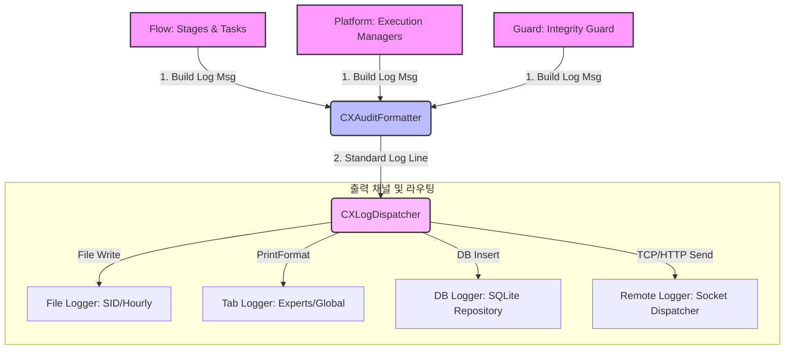

# [Design] AGS 통합 로그 출력 형식 정의 설계서 (v1.0)

## Document History
| Version | Date | Description | Author |
| :--- | :--- | :--- | :--- |
| v1.0 | 2026-05-30 | Initial Integrated Logging Format (UAF & Trading Standard Consolidation) | Antigravity |

---

## 1. 개요 및 목적 (Overview & Goals)

본 설계서는 AGS (Active Trading Session Engine) 전역에서 발생되는 모든 로그(시스템 로그, 파일 로그, 데이터베이스 로그, 원격 수집 로그)의 **출력 형식을 일관되게 규격화하고 통합 정의**하기 위해 작성되었습니다.

기존 시스템의 로그는 플랫폼 시스템 로그(Experts Journal)와 개별 세션 로그(File/Remote)가 독자적인 형식을 사용하여 통합 추적이 어려웠으며, 트레이딩 규격(v11.1)과 상태 감사 포맷(UAF) 간의 정렬이 미흡했습니다. 

### 핵심 설계 목표
1. **규격 일관성 (Dual-Write & Standardization)**: 모든 로그는 시스템 터미널 로그와 세션별 파일/원격 서버 로그에 동시에 남으며, 동일한 파싱 구조를 유지합니다.
2. **구조적 가용성 (Structure & Machine-Readability)**: 정형화된 대괄호(`[...]`) 블록 구조를 제공하여 정규식(Regex), ELK Stack(Logstash), 혹은 외부 AI 분석 모델이 정밀하게 파싱하고 분류할 수 있도록 합니다.
3. **SSOC 자산 연동 (SSOC Alignment)**: 가격(Price), 리스크(Risk), 심볼(Symbol), 실물 자산(Asset) 상태의 상호 참조 키(SID/GID, Ticket)가 모든 로그 항목에 누락 없이 마킹됩니다.
4. **성능 고려 설계 (Performance Preservation)**: 고속 틱(Tick) 환경에서 스트링 결합에 따른 성능 낭비를 막기 위한 캐싱 및 조건부 구성(Stable Mode) 메커니즘을 지원합니다.

---

## 2. 통합 로그 아키텍처 (Integrated Logging Architecture)

로그 생성부터 수집기 전달까지의 흐름은 다음과 같습니다. 모든 컴포넌트(`Task`, `Stage`, `Manager`)는 로그 생성 시 `CXAuditFormatter`를 거쳐 표준 로그 메시지를 생성하며, `CXLogDispatcher`가 이를 4대 채널 및 데이터베이스로 라우팅합니다.



---

## 3. 표준 로그 라인 구조 (Standard Log Line Structure)

AGS의 모든 로그 출력 라인은 다음과 같이 통일된 메타 헤더(Meta Header)와 바디(Body) 블록 구조로 고정됩니다.

```text
[TIMESTAMP] [LEVEL] [MODULE] [SID/GID] [TICKET/MAGIC] [PHASE] message {specData}
```

### 3.1. 메타 헤더 필드 정의
1. **TIMESTAMP**: `YYYY.MM.DD HH:MM:SS.fff` (밀리초 단위의 정확도). MQL5 환경에서 `GetMicrosecondCount()` 및 `TimeCurrent()`를 조합하여 산출합니다.
2. **LEVEL**: 로그 중요도를 나타내며, `[DEBUG]`, `[INFO]`, `[WARN]`, `[ERROR]`, `[FATAL]` 5개 고정 폭(5자)으로 정렬하여 텍스트 정렬 가독성을 보장합니다.
3. **MODULE**: 로그를 생성한 레이어를 구체적으로 명시합니다. (`CORE`, `DOMAIN`, `PLATFORM`, `BOOTSTRAP`, `GUARD`, `ORCH`, `FLOW`, `TEST`)
4. **SID/GID**: 트레이딩 세션을 고유하게 상호 참조할 수 있는 SID (`CNO(4)-YYMMDDHH(8)-SNO(2)-GNO(2)-DIR(1)-TYPE(1)`) 혹은 그룹 ID(GID)를 기재합니다. 미지정 시 `[N/A-SID]`로 처리합니다.
5. **TICKET/MAGIC**: MT5 실물 주문 티켓 번호와 매직 넘버를 `[TK:{ticket}, M:{magic}]` 형식으로 고정 마킹합니다.

> [!NOTE]
> 정적 텍스트 정렬과 파싱 편의성을 위해 메타 헤더의 순서 및 폭(Width) 규격은 반드시 보존되어야 합니다.

---

## 4. 핵심 트레이딩 로그 표준 규격 (Trading Logging Standard v11.1)

거래 실행 컴포넌트(`CXOrderManager`, `CXPositionManager`)는 주문 및 포지션 수정 요청 시 **Trading Logging Standard (v11.1)**에서 지정한 프리픽스 형식을 메타 헤더 뒤의 `[PHASE] message` 영역에 정확히 주입해야 합니다.

### 4.1. 주문 진입 (OrderOpen) 규격
* **성공 로그**: `[EXEC-ENTRY] Sending Order: [Sym:{symbol}, Type:{type}, Lot:{lot}, Price:{price}, SL:{sl}, TP:{tp}, Mkt:{marketPrice}, M:{magic}, SID:{sid}]`
* **실패 로그**: `[EXEC-ENTRY-FAIL] Broker Code:{ret_code}({description}), SysErr:{err}. Raw: [Sym:{symbol}, Lot:{lot}, P:{price}, SL:{sl}, TP:{tp}, M:{magic}, SID:{sid}]`

### 4.2. 주문 수정 (OrderModify) 규격
* **성공 로그**: `[ORDER-MODIFY] Sending Request: [Ticket:{ticket}, M:{magic}, Price:{price}, SL:{sl}, TP:{tp}]`
* **실패 로그**: `[ORDER-MODIFY-FAIL] Broker Code:{ret_code}({description}), SysErr:{err}. Raw: [Ticket:{ticket}, M:{magic}, Price:{price}, SL:{sl}, TP:{tp}]`

### 4.3. 포지션 수정 (PositionModify) 규격
* **성공 로그**: `[POS-MODIFY] Sending Request: [Ticket:{ticket}, M:{magic}, SL:{sl}, TP:{tp}]`
* **실패 로그**: `[POS-MODIFY-FAIL] Broker Code:{ret_code}({description}), SysErr:{err}. Raw: [Ticket:{ticket}, M:{magic}, SL:{sl}, TP:{tp}]`

### 4.4. 주문 삭제 (OrderDelete) 규격
* **성공 로그**: `[ORDER-DELETE] Sending Request: [Ticket:{ticket}, M:{magic}]`
* **실패 로그**: `[ORDER-DELETE-FAIL] Broker Code:{ret_code}({description}), SysErr:{err}. Raw: [Ticket:{ticket}, M:{magic}]`

---

## 5. Universal Audit Format (UAF) 통합 설계

태스크 및 스테이지 실행 시에는 자산 상태 진단을 위한 **Universal Audit Format (UAF)** 로그가 출력됩니다. 이는 4개의 정밀 데이터 블록으로 세분화되며, `CXAuditFormatter`가 이를 조합합니다.

### 5.1. UAF 세부 데이터 블록 구조
```text
[Block 1: Base Context] [Block 2: Trailing Parameter] [Block 3: Trading Price] {Block 4: Special Custom Context}
```

* **Block 1 (기본 콘텍스트)**: 식별 정보 및 현재 라이프사이클 상태를 표현합니다.
  - 포맷: `[FUNC:{action}] [SID] [TK:{ticket}, M:{magic}] [{symbol}, {lot}, {direction}, {xe_status}]`
  - 예시: `[FUNC:ActiveAlign] [CNO1-26053021-01-01-0-1] [TK:482091, M:1001] [XAUUSD, 0.50, BUY, EXEC]`
* **Block 2 (트레일링 파라미터)**: `GEMINI.md` 규격에 부합하는 트레일링 평가 수치 및 타겟 포인트를 표현합니다.
  - 포맷: `[ESTART:{teStart}, ESTEP:{teStep}, ELIMIT:{teLimit}, ESTART_PRICE:{teStartPrice}, ELIMIT_PRICE:{teLimitPrice}, SSTART:{tsStart}, SSTEP:{tsStep}, SL:{sl}, TP:{tp}]`
  - 예시: `[ESTART:20, ESTEP:5, ELIMIT:50, ESTART_PRICE:1945.20, ELIMIT_PRICE:1942.10, SSTART:30, SSTEP:10, SL:150, TP:300]`
* **Block 3 (실시간 가격 데이터)**: 주문/포지션의 가격과 현재 실물 시장 가격(Mkt Ask/Bid)을 결합합니다.
  - 포맷: `[P:{priceOpen}, SL:{priceSL}, TP:{priceTP}, Mkt:{marketPrice}]`
  - 예시: `[P:1940.50, SL:1939.00, TP:1943.50, Mkt:1941.20]`
* **Block 4 (클래스별 커커스텀 데이터 - SpecData)**: 개별 태스크/스테이지가 특별히 수집해야 하는 내부 변수를 구조화된 JSON 또는 중괄호 딕셔너리로 마킹합니다.
  - 포맷: `{Key1:Value1, Key2:Value2}`
  - 예시: `{ErrCount:0, Extremum:1945.82}`

### 5.2. 성능 절약 옵션 (Stable Mode)
초당 수십 번의 틱이 발생하는 시장 상황에서 매번 실시간 호가 조회 및 문자열 포맷팅이 가동되면 실행 지연이 발생할 수 있습니다.
* **Stable Mode 활성화 시 (`stable = true`)**:
  - `Block 3`의 실시간 시장 호가(`Mkt`) 조회를 건너뛰고 `[Mkt:STABLE]` 문자열 상수로 대체합니다.
  - `Block 2`의 동적 추격 예상 진입 가격(`ESTART_PRICE`, `ELIMIT_PRICE`) 계산을 전면 생략하여 CPU 연산 점유를 최소화합니다.

---

## 6. 로그 라우팅 및 출력 레벨 정의 (Levels & Routing Matrix)

출력 채널은 중요도에 따라 다르게 필터링되며, `CXLogDispatcher`가 실시간으로 처리합니다.

| 로그 레벨 (LEVEL) | 설명 | 출력 타겟 |
| :--- | :--- | :--- |
| **FATAL** | 엔진 오작동, 치명적 환경 결함, 자폭(Self-Deinit) 직전 상태 | Experts Journal, Local File, Remote Collector, SQLite DB |
| **ERROR** | 주문 실패(Broker 거절), 무결성 검증 실패(DI 오류), 데이터베이스 예외 | Experts Journal, Local File, Remote Collector, SQLite DB |
| **WARN** | 슬리피지 허용치 초과, 데이터 지연 감지, 실물 자산 불일치 자동 복구 시도 | Experts Journal, Local File, SQLite DB |
| **INFO** | 주문 진입 요청, 세션 상태 천이 완료, 타이머 사이클 확인, UI 갱신 | Local File, Remote Collector, SQLite DB |
| **DEBUG** | 바인딩 검사 과정, 개별 태스크의 세부 계산 중간 값 | Local File (활성화 시에만), SQLite DB |

### 6.1. 이관 및 아카이빙 (Archiving Strategy)
* 세션이 최종적으로 청산 완료(`xa_exit=2`) 혹은 아카이빙(`xa_exit=3`) 상태로 전환될 시, `CXLogDispatcher`는 해당 세션의 로컬 파일 핸들을 즉시 `Close()`하고, 이관 완료 표식을 마지막 라인으로 명시합니다:
  ```text
  [2026.05.30 21:05:12.981] [INFO] [CORE] [CNO1-26053021-01-01-0-1] [TK:482091, M:1001] [STATE-TRANSITION] Session lifecycle ARCHIVED. Releasing log handle.
  ```

---

## 7. MQL5 구현 가이드라인 (Implementation Guidance)

본 설계를 반영하기 위해 `CXAuditFormatter`와 `CXLogDispatcher`가 취해야 할 MQL5 측면의 구현 방향은 다음과 같습니다.

### 7.1. 타임스탬프 밀리초 획득 매크로 정의
터미널은 기본적으로 초 단위의 `TimeToString`만 제공하므로, 다음과 같이 밀리초를 조합하여 정확한 타임스탬프 헤더를 빌드합니다.
```mql5
string GetLogTimestamp() {
    MqlDateTime dt;
    TimeCurrent(dt);
    uint ms = GetMicrosecondCount() / 1000 % 1000;
    return StringFormat("%04d.%02d.%02d %02d:%02d:%02d.%03u", 
                        dt.year, dt.mon, dt.day, dt.hour, dt.min, dt.sec, ms);
}
```

### 7.2. 디스패치 통합 인터페이스 예시
`CXLogDispatcher`의 `Log` 메서드는 다음과 같이 헤더를 전면부에 배치하고 바디 메시지를 조합하도록 갱신해야 합니다.
```mql5
void CXLogDispatcher::Log(ENUM_LOG_LEVEL level, string msg) {
    if(!m_enabled) return;
    
    // 메타 헤더 빌드
    string timestamp = GetLogTimestamp();
    string fullLine = StringFormat("[%s] [%s] %s\r\n", timestamp, EnumToString(level), msg);
    
    // 채널별 출력 배분
    if(IsOk(m_file) && m_file.IsEnabled()) {
        m_file.Log(level, fullLine); // 파일 로거에는 기조립 라인을 바로 기록
    }
    
    if(IsOk(m_tab) && m_tab.IsEnabled()) {
        Print(fullLine); // MT5 Experts 저널 출력
    }
    
    // ... Remote 및 DB 동일하게 분배
}
```

> [!WARNING]
> MT5 터미널 로그의 용량 폭증을 방지하기 위해, 초고속 틱이 발생하는 구간에서는 `DEBUG` 레벨 로그가 시스템 로그(Tab)에 중복 기록되지 않도록 디스패처 레벨에서 상시 필터링 제어가 이루어져야 합니다.
