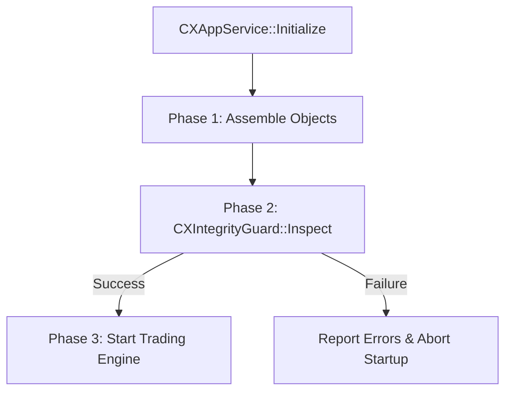

# [DESIGN] AGS v2.1: Independent Assembly Inspector (IAI) - CXIntegrityGuard

**Version**: v1.0  
**Status**: Proposed  
**Date**: 2026-05-29  
**Target**: Separation of Validation Concerns & Enhanced System Observability

## 1. 개요 (Background)
AGS v2.0에서 도입된 PVB(Pre-Validated Binding) 패턴은 시스템 안정성을 크게 향상시켰으나, 관련 검증 로직이 `CXAppService`와 `AppOrchestrator`에 산재되어 있어 클래스 응집도가 낮아지고 유지보수가 복잡해지는 문제가 있었습니다. 이를 해결하기 위해 검증 로직을 독립된 서비스인 `CXIntegrityGuard`로 격상하여 관리합니다.

## 2. 설계 목표 (Design Goals)
- **관심사 분리 (SoC)**: 실행 제어(`AppService`)와 구조 정의(`Orchestrator`)에서 검증 로직을 완전히 분리.
- **검증의 재사용성**: 실구동 EA와 테스트 환경(`_Test`)에서 동일한 검증 엔진 사용.
- **정밀 진단 보고**: 단순 성공/실패를 넘어 조립 상태에 대한 상세 리포트 제공.
- **Fail-Fast 강화**: 트레이딩 로직 실행 전 모든 의존성 및 논리적 연결성 확정.

## 3. 핵심 구조 (Core Structure)

### 3.1 인터페이스 (`ICXIntegrityGuard.mqh`)
```cpp
class ICXIntegrityGuard : public CObject {
public:
    virtual ~ICXIntegrityGuard() {}
    
    /**
     * @brief 조립 무결성 전수 검사 실행
     * @param globalCtx 전역 컨텍스트 (서비스 저장소)
     * @param orchestrator 시퀀스 오케스트레이터 (구조 정의)
     * @return 모든 검증 통과 시 true
     */
    virtual bool Inspect(ICXContext* globalCtx, ICXSequenceOrchestrator* orchestrator) = 0;
    
    /**
     * @brief 검사 결과 상세 리포트 획득
     */
    virtual string GetDetailedReport() const = 0;
};
```

## 4. 검증 파이프라인 (The Inspection Pipeline)

`CXIntegrityGuard`는 다음 3단계 검증을 순차적으로 수행합니다.

1.  **Service Registry Audit**:
    - `GlobalContext`에 등록된 필수 서비스(`repo`, `price_mgr`, `sym_mgr` 등)의 존재 여부 및 인터페이스 정합성 확인.
2.  **Structural Binding Test**:
    - 오케스트레이터가 관리하는 모든 시퀀스(Watcher, Session) 노드를 재귀적으로 순회.
    - 각 스테이지와 태스크의 `Bind()`를 호출하여 내부 멤버 변수 바인딩 상태 확인.
3.  **Circuit Connectivity**:
    - 시퀀스 전이 ID들이 유효한지 검증.
    - 터미널 상태(SYS_ERROR, SYS_CLOSED)로의 경로가 올바르게 확보되었는지 확인.

## 5. 워크플로우 (Workflow)



## 6. 기대 효과 (Expected Benefits)
- **가시성(Observability)**: 기동 실패 시 정확한 실패 위치(스테이지명, 태스크명)와 원인(누락된 서비스명)을 즉시 파악.
- **성능**: 런타임 체크를 기동 시 1회 검증으로 완전히 대체하여 실행 효율 극대화.
- **유지보수**: 새로운 부품이나 로직 추가 시 검사기에 항목만 추가하면 전수 검사가 자동으로 이루어짐.
