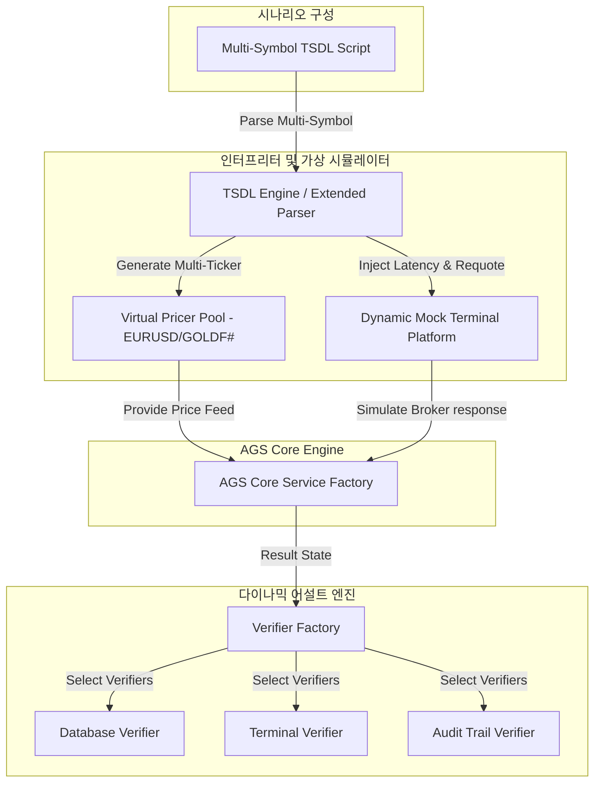

# [Design] AGS 테스트 프레임워크 코드 분석 및 고도화 설계 보고서 (v1.0)

**Status**: Proposed  
**Author**: Antigravity  
**Target**: AGS 테스트 인프라(`MT5/_Test`)의 현황을 정밀 진단하고, TSDL 및 모킹 성능을 한 단계 끌어올리기 위한 차세대 테스트 아키텍처를 설계함.

---

## 1. AGS 테스트 프로젝트 현황 분석

AGS 테스트 프로젝트(`MT5/_Test`)는 가상 시장 데이터와 모의 거래 환경을 기반으로 시스템의 동작을 결정론적(Deterministic)으로 검증하기 위해 다음과 같이 2개축으로 이중화 설계되어 있습니다.

### 1.1 단위 테스트 엔진 (`AGSTestRunner.mq5`)
- **역할**: 외부 인프라 의존성을 완전히 제거한 고립 환경(Isolated Sandbox)에서 개별 태스크(`IXTask`) 및 스테이지(`IXStage`)의 기능 단위 테스트를 고속 수행합니다.
- **핵심 컴포넌트**:
  - `MockRepository.mqh`: SQLite DB 대신 메모리상에서 신호 데이터의 CRUD를 흉내 냄.
  - `MockAssetManager.mqh`: 세션 생태계 관리를 모사하는 경량 인벤토리 스톱.
  - `UnitTests/*`: `TestTrailingEntry`, `TestTrailingStop`, `TestRedirectRecovery` 등 주요 상태 전이 조건 검증 스위트.

### 1.2 E2E 시나리오 검증 엔진 (`CXScenarioRunner.mq5`)
- **역할**: TSDL(Test Scenario Definition Language)이라는 행동 기술 언어로 작성된 스크립트를 실시간 파싱하여, 시뮬레이션 틱 단위로 이벤트를 주입하고 전체 라이프사이클의 정합성을 검증합니다.
- **핵심 컴포넌트**:
  - `CXTsdlParser.mqh`: TSDL의 `DEFINE`, `PRICER`, `TICK` 구문(액션 `>` 및 기대치 `?`)을 기계적으로 해석.
  - `CXVirtualPricer.mqh`: 브라운 운동 모형 또는 고정 트렌드 모델에 따라 가상 Bid/Ask 시세를 생성.
  - `MockTerminalPlatform.mqh`: 주문 전송 지연, 부분 체결, 강제 청산 등 브로커 단말의 물리적 반응을 모킹.

---

## 2. 현 프레임워크의 한계점 (Pain Points)

1.  **단일 심볼 시뮬레이션 제약**:
    - 가상 프라이서(`CXVirtualPricer`) 및 액션 처리가 골드 선물(`GOLDF#`) 단일 통화/상품에 맞춰 하드코딩되거나 강결합되어 있어, 다중 심볼(유로/달러 병행 거래 등) 포지션을 연계 구동하는 포트폴리오 차원의 E2E 검증이 불가능합니다.
2.  **VerifyExpectation의 하드코딩 구조 (OCP 위배)**:
    - 검증하려는 기대 속성(예: `xe_status`, `xa_exit`, `sl`, `tp`, `exists` 등)이 추가되거나 비교 대상이 변경될 때마다 `CXScenarioRunner.mq5` 내부의 `VerifyExpectation` 조건문을 직접 수정해야 하는 구조적 결합이 존재합니다.
3.  **예외/지연 모킹의 정적 상태 관리**:
    - 브로커 거래의 런타임 지연(Latency), 리쿼트(Requote) 발생, 일시적 인터넷 단절(Disconnect) 등의 특수한 엣지 케이스 시나리오를 TSDL 틱 도중에 동적으로 지시하여 반응하는 인터페이스가 부재합니다.
4.  **시나리오 배치 검증 및 결과 집계 미비**:
    - 12종 시나리오 파일을 순차적으로 구동하려면 수동으로 입력 파라미터를 교체하여 컴파일 및 가동해야 하므로, CI/CD 자동화 파이프라인에서 '전체 시나리오 성공/실패 여부'를 JSON 형태 등으로 일괄 추출할 방법이 없습니다.

---

## 3. 테스트 프로젝트 고도화 설계안 (To-Be)



### 3.1 다중 가상 프라이서 풀 (`CXVirtualPricerPool`) 구축
- **설계**: 가상 프라이서를 개별 인스턴스가 아닌 상품명(Symbol)을 키로 하는 해시 맵 구조의 풀(`CHashMap<string, CXVirtualPricer*>`)로 확장합니다.
- **효과**: TSDL 시나리오 상에서 `> MARKET: EURUSD : price=1.0925` 와 같이 심볼별 시세를 병렬적으로 제어하고, 복수 자산 세션의 Pulse 전이를 교차 검증합니다.

### 3.2 Dynamic Mocking Engine (동적 모킹 프레임워크) 고도화
- **브로커 거래 지연 시뮬레이션**: `MockTerminalPlatform`에 `QueueTradeRequest(delayTicks)` 메서드를 장착하여, 체결 요청 후 N틱 동안 펜딩 상태(`XE_PENDING_REQ`)를 명시적으로 유지시켰다가 체결되도록 시뮬레이션합니다.
- **동적 통신 장애 주입**: TSDL 액션으로 `> FAIL: connection : status=disconnect` 지시 시, MT5 단말 접속 끊김을 모사하여 태스크의 예외 복구 경로가 정상 동작하는지 테스트합니다.

### 3.3 verifier 인터페이스 분리 (Dynamic Asserts)
- **설계**: `VerifyExpectation` 내부의 거대한 조건문을 분리하여 `IXTsdlVerifier` 인터페이스를 설계합니다.
  ```mql5
  interface IXTsdlVerifier {
      bool Verify(CXTsdlExpect* expect, MockTerminalPlatform* terminal, IRepository* repo, string &outMsg);
  };
  ```
- **구현**: `CXSessionVerifier`, `CXTerminalVerifier`, `CXPositionVerifier` 등 단위 검증 클래스를 개별 파일로 쪼개어, 팩토리를 통해 바인딩하도록 합니다.
- **효과**: 신규 검증 지표가 추가되더라도 기존 러너 소스를 전혀 건드리지 않고 플러그인 형식으로 검증기를 추가할 수 있습니다.

### 3.4 자동 집계 자동화 및 JSON 리포트 파이프라인
- **설계**: `CXScenarioRunner`가 전체 시나리오를 돌린 후, 최종 테스트 결과 요약(Passed Ticks, Failed Details, Error Trace)을 SQLite DB의 `TestResult` 테이블 또는 로컬 파일인 `Files\ATSE\test_report.json`으로 구조화하여 출력하도록 개선합니다.
- **CI 연동**: 빌드 스크립트(`build.ps1`)와 연동하여 헤드리스(Headless) 환경에서 전체 테스트 패스 여부를 엑셀이나 JSON 보고서로 일괄 출력 및 수집합니다.

---

## 4. 향후 로드맵 (Action Items)

1.  **1단계 (Infrastructure)**: `ICXParam` UDP 고도화 완료에 맞추어 `CXTestServiceFactory` 및 Mocks의 의존성 바인딩을 PVB 표준으로 마이그레이션.
2.  **2단계 (Parser Upgrade)**: `CXTsdlParser`에서 다중 프라이서 매핑 및 Multi-Symbol 파싱 문법 탑재.
3.  **3단계 (Decoupled Asserts)**: 검증부(`VerifyExpectation`)의 Verifier 인터페이스 객체지향 분리 및 모킹 리프 기법 적용.
4.  **4단계 (CI Automation)**: 빌드 로그 수집기 및 JSON 요약 보고 파이프라인 구축.
