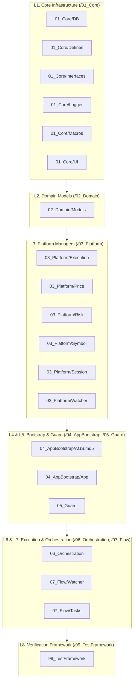
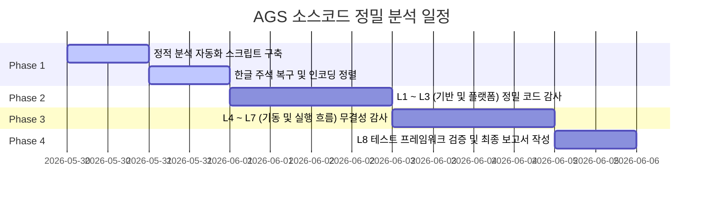

# [Plan] AGS 코드 전체 정밀 분석 계획서 (v1.0)

## 1. 개요 및 목적 (Introduction & Objectives)

본 계획서는 AGS (Active Trading Session Engine) 시스템의 전체 소스코드를 대상으로 아키텍처 일관성, 거래 안정성, 그리고 MQL5 표준 규격 준수 여부를 검증하기 위한 **정밀 분석(Precision Audit) 실행 계획**입니다.

최근 단행된 Dual-Zone 아키텍처 기반의 폴더 재배치(MT5/ 및 Test/)와 함께, 핵심 런타임 최적화를 위한 **PVB (Pre-Validated Binding)** 및 **UDP (Universal Data Parameter)** 패턴이 설계서에 명시되었습니다. 이에 따라 실제 코드 구현이 설계 규격과 규칙을 충족하는지 정밀하게 분석하고, 잠재적인 결함과 성능 병목을 선제적으로 찾아내는 것을 목적으로 합니다.

### 핵심 분석 목표
1. **아키텍처 부합성 검증**: PVB 및 UDP 아키텍처 패턴이 계층별(Core, Domain, Platform, Flow)로 올바르게 구현 및 적용되었는지 검증.
2. **트레이딩 프로세스 표준(SSOC) 감사**: 모든 거래 가격 계산, 리스크 검증, 심볼 조회, 터미널 자산 조회가 지정된 매니저(`ICXPriceManager`, `ICXRiskManager`, `ICXSymbolManager`, `ICXAssetManager`)에 집중(Single Source of Calculation)되어 있는지 확인.
3. **트레이딩 로깅 표준(v11.1) 준수 여부**: `OrderOpen`, `OrderModify`, `PositionModify`, `OrderDelete` 등 핵심 주문 집행 단계의 로그 프리픽스와 형식의 완벽한 일치성 검토.
4. **루프 안정성 및 자원 관리(v11.4) 검증**: 리스트 순회 중 인덱스 동적 변경 금지, 일괄 삭제(Atomic Batch Delete), Dangling Pointer 방지 여부 확인.
5. **ID Governance & 상태 천이 행렬 준수**: ID 규격(SID/GID) 생성 위임 및 DB 상태 플래그(`xa_entry`, `xa_exit`, `xe_status`)의 전이 정합성 분석.
6. **주석 인코딩 복구 대책 수립**: 일부 `.mqh` 및 `.mq5` 파일의 한글 주석이 더블 인코딩(UTF-8 -> CP949 -> UTF-16LE)으로 인해 문자 유실이 발생한 부분에 대한 정합성 복원 전략 포함.

---

## 2. 정밀 분석 기준 및 규칙 (Audit Criteria & Rules)

분석 시 다음의 **USER Rules (GEMINI.md)** 및 아키텍처 표준 규격을 준수 평가 척도로 사용합니다.

### 2.1. Trading Process Standard (SSOC - v11.3)
* **Price Manager 의존성**: 시장가 및 진입가 계산, 손절/익절(SL/TP) 계산 시 `ICXPriceManager`만 사용해야 함.
* **Risk Manager 의존성**: 로트 크기 및 마진 검증은 `ICXRiskManager`를 거치며, 로트가 $0$ 이하이거나 $50$을 초과하는 행위는 차단되어야 함.
* **Symbol Manager 의존성**: `Point`, `Digits`, `StopsLevel` 등의 속성은 `ICXSymbolManager` 캐시를 거쳐 조회해야 함.
* **Inventory Manager 의존성**: 터미널 실물 자산 유무는 `ICXInventoryManager`(`CXAssetManager`)를 사용하고 자산 상태를 `ICXSignal`과 동기화해야 함.
* **신호가 무시 & 시장가 보정**: `price_signal`은 무시하고 실시간 `execPrice`를 적용하며 지정가 역전 시 보정을 수행해야 함.
* **포인트 기반 변환**: SL, TP, TE, TS 등은 모두 포인트 단위로 관리하고 최종 가격 계산 시에만 변환하는 규칙 적용 여부 확인.

### 2.2. Trading Logging Standard (v11.1)
모든 포지션/주문 집행은 아래 로그 형식과 일치해야 합니다:

| 유형 | 상태 | 로그 프리픽스 및 포맷 규격 |
| :--- | :--- | :--- |
| **OrderOpen** | 성공 | `[EXEC-ENTRY] Sending Order: [Sym:{symbol}, Type:{type}, Lot:{lot}, Price:{price}, SL:{sl}, TP:{tp}, Mkt:{marketPrice}, M:{magic}, SID:{sid}]` |
| | 실패 | `[EXEC-ENTRY-FAIL] Broker Code:{ret_code}({description}), SysErr:{err}. Raw: [Sym:{symbol}, Lot:{lot}, P:{price}, SL:{sl}, TP:{tp}, M:{magic}, SID:{sid}]` |
| **OrderModify**| 성공 | `[ORDER-MODIFY] Sending Request: [Ticket:{ticket}, M:{magic}, Price:{price}, SL:{sl}, TP:{tp}]` |
| | 실패 | `[ORDER-MODIFY-FAIL] Broker Code:{ret_code}({description}), SysErr:{err}. Raw: [Ticket:{ticket}, M:{magic}, Price:{price}, SL:{sl}, TP:{tp}]` |
| **PositionModify**| 성공 | `[POS-MODIFY] Sending Request: [Ticket:{ticket}, M:{magic}, SL:{sl}, TP:{tp}]` |
| | 실패 | `[POS-MODIFY-FAIL] Broker Code:{ret_code}({description}), SysErr:{err}. Raw: [Ticket:{ticket}, M:{magic}, SL:{sl}, TP:{tp}]` |
| **OrderDelete** | 성공 | `[ORDER-DELETE] Sending Request: [Ticket:{ticket}, M:{magic}]` |
| | 실패 | `[ORDER-DELETE-FAIL] Broker Code:{ret_code}({description}), SysErr:{err}. Raw: [Ticket:{ticket}, M:{magic}]` |

### 2.3. Loop Stability & Memory Safety (v11.4)
* **Index Manipulation 금지**: 루프 내부에서 `Detach()`, `i--`, `total--` 등 크기/인덱스를 변경하는 코드가 존재하는지 확인.
* **루프 순회 방향**: 고정 작업 큐로 취급하여 순방향(`0 -> Total`) 순회 원칙 준수 여부.
* **Atomic Batch Delete**: 개별 객체의 루프 내 삭제(`SAFE_DELETE`)를 금지하고 리스트 단위의 일괄 해제(`Clear()`) 검증.
* **Dangling Pointer 방지**: 루프 종료 즉시 포인터 초기화(`xp.SetSignal(NULL)`) 및 컨텍스트 정리 준수 여부.

### 2.4. ID Governance & 상태 천이 행렬 (v8.2 / v9.8.11)
* **ID 관리**: 모든 SID/GID 생성은 `XIdManager`(`CXIdManager.mqh`)에 위임해야 함.
* **상태 전이 매트릭스**:
  - 신규 주입: `xa_entry=1`, `xa_exit=0`, `xe_status=0 (READY)`
  - 청산 요청: `xa_exit=1 (ACTIVE)`
  - 청산 완료: `xa_exit=2 (COMP)`, `xe_status=20 (CLOSED)`
  - 수동 청산 패스트 트랙: `xe_status=24`, `xa_exit=2` 동시 마킹 및 즉시 종료.
  - 이관 대기: `xa_exit=3 (ARCH)`
  - 세부 실행 상태 (`xe_status`): 0(READY), 1(PENDING_REQ), 2(IN_TRANSIT), 5(PENDING_PLACED), 10(EXECUTED), 20(CLOSED_SIGNAL), 21(CLOSED_SL), 22(CLOSED_TP), 99(ERROR)

---

## 3. 분석 대상 및 범위 (Target Components & Files)

분석 대상은 `d:\Projects\AGS\MT5\` 하위의 8개 레이어로 세분화됩니다.

### 3.1. 레이어별 정밀 분석 대상 파일 목록

#### L1. Core Infrastructure (`MT5/01_Core/`)
* **DB**: SQLite 래퍼 인터페이스 및 리포지토리 검증
  * [CXDatabase.mqh](file:///d:/Projects/AGS/MT5/01_Core/DB/CXDatabase.mqh)
  * [CXSignalRepository.mqh](file:///d:/Projects/AGS/MT5/01_Core/DB/CXSignalRepository.mqh)
* **Defines**: ID 관리자 및 상수 정의
  * [CXDefine.mqh](file:///d:/Projects/AGS/MT5/01_Core/Defines/CXDefine.mqh)
  * [CXIdManager.mqh](file:///d:/Projects/AGS/MT5/01_Core/Defines/CXIdManager.mqh)
* **Logger**: 포맷터 및 다양한 채널의 로거 정합성
  * [CXAuditFormatter.mqh](file:///d:/Projects/AGS/MT5/01_Core/Logger/CXAuditFormatter.mqh)
  * [CXDbLogger.mqh](file:///d:/Projects/AGS/MT5/01_Core/Logger/CXDbLogger.mqh)
  * [CXFileLogger.mqh](file:///d:/Projects/AGS/MT5/01_Core/Logger/CXFileLogger.mqh)
  * [CXFileLoggerSID.mqh](file:///d:/Projects/AGS/MT5/01_Core/Logger/CXFileLoggerSID.mqh)
  * [CXLogDispatcher.mqh](file:///d:/Projects/AGS/MT5/01_Core/Logger/CXLogDispatcher.mqh)
  * [CXRemoteLogger.mqh](file:///d:/Projects/AGS/MT5/01_Core/Logger/CXRemoteLogger.mqh)

#### L2. Domain Models (`MT5/02_Domain/`)
* **Models**: 데이터 모델 및 컨텍스트 파라미터 구조
  * [CXConfig.mqh](file:///d:/Projects/AGS/MT5/02_Domain/Models/CXConfig.mqh)
  * [CXContext.mqh](file:///d:/Projects/AGS/MT5/02_Domain/Models/CXContext.mqh)
  * [CXParam.mqh](file:///d:/Projects/AGS/MT5/02_Domain/Models/CXParam.mqh) (Universal Data Parameter 핵심체)
  * [CXSignal.mqh](file:///d:/Projects/AGS/MT5/02_Domain/Models/CXSignal.mqh)

#### L3. Platform Managers (`MT5/03_Platform/`)
* **Execution**: 주문 및 포지션의 물리적 집행 레이어 (로깅 표준 점검 핵심 대상)
  * [CXEntryManager.mqh](file:///d:/Projects/AGS/MT5/03_Platform/Execution/CXEntryManager.mqh)
  * [CXExitManager.mqh](file:///d:/Projects/AGS/MT5/03_Platform/Execution/CXExitManager.mqh)
  * [CXOrderManager.mqh](file:///d:/Projects/AGS/MT5/03_Platform/Execution/CXOrderManager.mqh)
  * [CXPositionManager.mqh](file:///d:/Projects/AGS/MT5/03_Platform/Execution/CXPositionManager.mqh)
  * [CXTerminalPlatform.mqh](file:///d:/Projects/AGS/MT5/03_Platform/Execution/CXTerminalPlatform.mqh)
* **SSOC Core Managers**: 단일 연산 원칙 준수 확인
  * [CXPriceManager.mqh](file:///d:/Projects/AGS/MT5/03_Platform/Price/CXPriceManager.mqh)
  * [CXRiskManager.mqh](file:///d:/Projects/AGS/MT5/03_Platform/Risk/CXRiskManager.mqh)
  * [CXSymbolManager.mqh](file:///d:/Projects/AGS/MT5/03_Platform/Symbol/CXSymbolManager.mqh)
  * [CXAssetManager.mqh](file:///d:/Projects/AGS/MT5/03_Platform/Session/CXAssetManager.mqh) (실물 인벤토리)

#### L4 & L5. Control, Bootstrap & Guard (`MT5/04_AppBootstrap/`, `MT5/05_Guard/`)
* **Bootstrap**: EA 기동 및 라이프사이클 총괄
  * [AGS.mq5](file:///d:/Projects/AGS/MT5/04_AppBootstrap/AGS.mq5)
  * [CXAppService.mqh](file:///d:/Projects/AGS/MT5/04_AppBootstrap/App/CXAppService.mqh)
* **Guard**: 무결성 검사 및 의존성 사전 정합성 체크
  * [CXIntegrityGuard.mqh](file:///d:/Projects/AGS/MT5/05_Guard/CXIntegrityGuard.mqh)
  * [TestDependencyInjection.mqh](file:///d:/Projects/AGS/MT5/05_Guard/TestDependencyInjection.mqh)

#### L6. Assembly & Orchestration (`MT5/06_Orchestration/`)
* **Orchestrator**: 태스크/스테이지 조립 및 PVB 바인딩 전파 통로
  * [AppOrchestrator.mqh](file:///d:/Projects/AGS/MT5/06_Orchestration/Workflow/AppOrchestrator.mqh)
  * [CXSequenceOrchestrator.mqh](file:///d:/Projects/AGS/MT5/06_Orchestration/Sequence/CXSequenceOrchestrator.mqh)
  * [CXFluentSequence.mqh](file:///d:/Projects/AGS/MT5/06_Orchestration/Sequence/CXFluentSequence.mqh)

#### L7. Execution Flow (`MT5/07_Flow/`)
* **Stages**: 신호 탐색 및 실행을 위한 스테이지 구현체 (PVB 캐싱 점검 대상)
  * [CXCompositeStage.mqh](file:///d:/Projects/AGS/MT5/07_Flow/Session/CXCompositeStage.mqh)
  * [CXStageEntryDiscovery.mqh](file:///d:/Projects/AGS/MT5/07_Flow/Watcher/CXStageEntryDiscovery.mqh)
  * [CXStageEntryExecute.mqh](file:///d:/Projects/AGS/MT5/07_Flow/Watcher/CXStageEntryExecute.mqh)
  * [CXStageExitDiscovery.mqh](file:///d:/Projects/AGS/MT5/07_Flow/Watcher/CXStageExitDiscovery.mqh)
  * [CXStageExitExecute.mqh](file:///d:/Projects/AGS/MT5/07_Flow/Watcher/CXStageExitExecute.mqh)
* **Tasks**: 개별 마이크로 태스크 (PVB 바인딩 및 UDP 결합도 검증)
  * **Active**: [CXTaskActive_P_Align.mqh](file:///d:/Projects/AGS/MT5/07_Flow/Tasks/Active/CXTaskActive_P_Align.mqh), [CXTaskIntentWatch.mqh](file:///d:/Projects/AGS/MT5/07_Flow/Tasks/Active/CXTaskIntentWatch.mqh)
  * **Exit**: [CXTaskExit_L_Prepare.mqh](file:///d:/Projects/AGS/MT5/07_Flow/Tasks/Exit/CXTaskExit_L_Prepare.mqh), [CXTaskExit_R_Order.mqh](file:///d:/Projects/AGS/MT5/07_Flow/Tasks/Exit/CXTaskExit_R_Order.mqh), [CXTaskExit_V_Terminal.mqh](file:///d:/Projects/AGS/MT5/07_Flow/Tasks/Exit/CXTaskExit_V_Terminal.mqh)
  * **Pending**: [CXTaskPending_V_Sync.mqh](file:///d:/Projects/AGS/MT5/07_Flow/Tasks/Pending/CXTaskPending_V_Sync.mqh)
  * **Trailing**: [CXTaskTrail_L_Evaluate.mqh](file:///d:/Projects/AGS/MT5/07_Flow/Tasks/Trailing/CXTaskTrail_L_Evaluate.mqh), [CXTaskTrail_R_Execute.mqh](file:///d:/Projects/AGS/MT5/07_Flow/Tasks/Trailing/CXTaskTrail_R_Execute.mqh)

#### L8. Verification Framework (`MT5/99_TestFramework/`)
* **Runners**: 단위 및 시나리오 테스트 작동 메커니즘 검토
  * [AGSTestRunner.mq5](file:///d:/Projects/AGS/MT5/99_TestFramework/AGSTestRunner.mq5)
  * [AGSScenarioRunner.mq5](file:///d:/Projects/AGS/MT5/99_TestFramework/AGSScenarioRunner.mq5)

---

## 4. 단계별 실행 계획 (Phased Action Plan)

정밀 분석은 다음 4단계에 걸쳐 실행되며, 각 단계별로 스크립트 기반 자동 정적 분석과 코드 검토를 병행합니다.

### Phase 1: 분석 자동화 및 인코딩 복구 (Preparation)
1. **정적 검사 자동화**:
   * PowerShell 또는 Python 스크립트를 작성하여 소스코드 내부의 미준수 항목(예: `SAFE_DELETE` 루프 내부 호출, `ICXSymbolManager`를 통하지 않는 심볼 속성 직접 조회, 정규식 기반의 Log 포맷 불일치 등)을 사전에 필터링하는 도구 마련.
2. **한글 주석 디코딩 및 보정 복구**:
   * 더블 인코딩된 문자열을 역추적(UTF-16LE -> CP949 바이트 해석 -> UTF-8 복원)할 수 있는 임시 복원 스크립트를 적용하여 주요 아키텍처 설명 주석 복원.
   * 복원 불가능한 소실 주석(`???` 및 `` 등)은 설계 문서를 참고하여 원본 의미로 수동 복구 및 패치.

### Phase 2: L1~L3 기반 인프라 및 플랫폼 감사 (Static & Platform Audits)
1. **UDP 및 DB 인터페이스 검토**:
   * `CXParam`이 단순 Getter/Setter 수준을 넘어 Dynamic Property Bag 및 Global/Local Context Dual-Binding을 올바르게 지원하는지 인터페이스 설계 적합성 분석.
   * `CXSignalRepository`에서 원시 쿼리가 난무하는지, 무결성 제약조건이 올바르게 설계되었는지 분석.
2. **SSOC 플랫폼 준수 검사**:
   * `CXPriceManager`, `CXRiskManager`, `CXSymbolManager`가 내부 캐시를 적절하게 이용하며 전산의 단일 원천(SSOT) 역할을 충실히 하는지 코드 추적.
   * **물리 주문 집행기 (`CXOrderManager`, `CXPositionManager`)** 내에서 플랫폼 API(MqlTradeRequest)를 가로채어 강제 검증을 수행하는 방어 코드 및 거래 로그 매칭 정밀 감사.

### Phase 3: L4~L7 기동 라이프사이클 및 실행 흐름 감사 (Lifecycle & Execution Audits)
1. **AppBootstrap & Guard 무결성 감사**:
   * `AGS.mq5` 기동 시 `CXIntegrityGuard`가 전체 14개 코어 서비스의 성공적 등록을 검증하는지 확인.
   * **Fail-Fast** 전략이 올바르게 작동하여 검증 실패 시 정상적으로 `INIT_FAILED`를 반환하고 즉시 Deinit 과정을 타는지 시뮬레이션 코드 분석.
   * `TestDependencyInjection::Verify()`의 검증 범위와 실효성 감사.
2. **PVB (Pre-Validated Binding) 적용도 감사**:
   * `CXCompositeStage`와 각 태스크(Active, Exit, Trailing 등)가 `Bind(ICXContext*)` 호출 시점에 의존성 포인터를 멤버 변수로 확실하게 로컬 캐싱하는지 검사.
   * 틱 단위로 도는 `Pulse()` 또는 `Execute()` 내에서 `CX_GET_OBJ`와 같은 해시맵 기반 동적 서비스 룩업이 잔존하는지 전수 조사하여 제거 대상 매핑.
3. **루프 안정성(Loop Stability) 조사**:
   * 각 태스크 리스트와 시퀀스 목록을 제어하는 `CXFluentSequence`, `CXCompositeStage` 내부에서 순방향 루프 도중 리스트 항목이 동적으로 누락되거나 안전하지 않은 이중 해제(`double-free`)가 일어날 가능성 분석.

### Phase 4: 테스트 정합성 및 보고서 작성 (Verification & Reporting)
1. **단위 테스트 및 시나리오 스크립트 정밀 분석**:
   * `MT5/99_TestFramework/UnitTests` 내부의 12종 단위 테스트 코드가 최신 아키텍처(PVB, UDP) 규격을 올바르게 모사하고 Mocking하는지 확인.
   * TSDL(Trading Scenario Description Language) 파서 및 러너가 물리 자산 상태 변화와 시나리오 제어 플래그를 정합성 있게 매칭하는지 진단.
2. **최종 코드 감사 리포트 발행**:
   * 각 아키텍처 규칙별 준수/미준수 현황 매트릭스 도출.
   * 코드 리팩토링 및 구조적 보완이 필요한 대상 파일의 구체적 위상 및 리팩토링 가이드 작성.

---

## 5. 예상 결과물 및 인도정의 (Expected Outputs & Deliverables)

1. **분석 계획서**: 본 계획서 (`_doc/PLAN_AGS_CODE_ANALYSIS_v1.0.md`) 공유 및 확정.
2. **한글 주석 인코딩 복구 스크립트**: `scratch/` 디렉토리에 UTF-16LE 더블 인코딩 한글 복원 도구 코드 저장.
3. **정밀 분석 결과 보고서**: 준수 평가 매트릭스와 위반 사항 리스트, 성능 최적화(Look-up 제거) 대상 리스트를 담은 `_doc/REPORT_AGS_CODE_ANALYSIS_v1.0.md` 파일 발행.
4. **리팩토링 이슈 백로그**: 개선 필요한 코드 블록에 대한 구체적 리팩토링 계획(Issue/Task checklist) 추가 수립.
