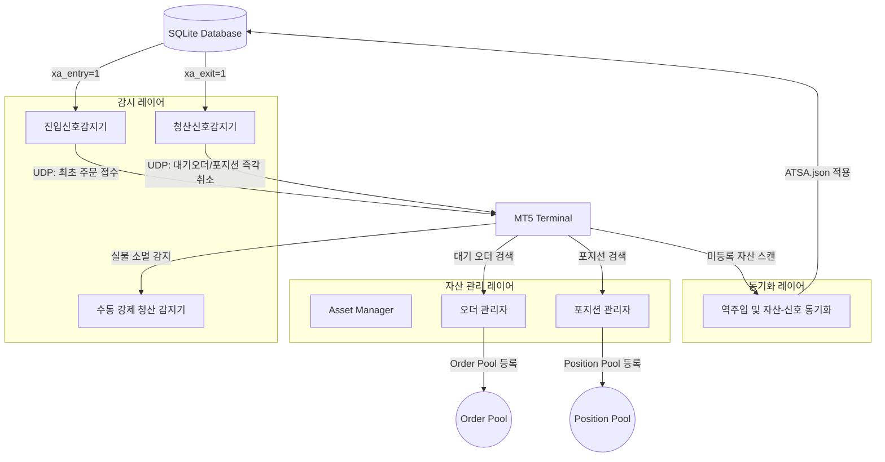

# [Plan] AGS 아키텍처 고도화 및 시스템 리팩토링 계획서 (v1.5)

## 1. 개요 (Overview)
본 계획서는 AGS (Active Trading Session Engine) 프로젝트의 핵심 아키텍처를 v2.0으로 진화시키기 위한 전반적인 작업 계획 및 리팩토링 로드맵입니다. 기존의 테스트 인프라 구축 계획(v1.4)을 포함하여, **[Pre-Validated Binding]** 및 **[Universal Data Parameter]** 패턴을 통한 시스템 구조 혁신과 이를 검증하기 위한 무결성 테스트 체계를 통합 관리합니다.

---

## 2. 핵심 아키텍처 개조 전략 (Architectural Evolution)

### 2.1 PVB (Pre-Validated Binding) - "Bind-then-Trust"
- **개념**: 런타임에 반복적으로 수행되던 서비스 조회를 기동 시점(Assembly-time)의 1회 바인딩으로 전환합니다.
- **적용**: `IXTask`, `IXStage`에 `Bind(ICXContext*)` 단계를 도입하여 필수 의존성을 멤버 변수로 캐싱합니다.
- **효과**: 매 틱 발생하는 Hash Map 조회 오버헤드 제거 및 `Execute()` 로직의 가독성 및 성능 획기적 향상.

### 2.2 UDP (Universal Data Parameter) - "Unified Context Carrier"
- **개념**: `CXParam`을 전역 컨텍스트, 지역 세션 데이터, 동적 속성을 모두 운반할 수 있는 범용 파라미터로 고도화합니다.
- **적용**: Fast Slots(핵심 데이터), Dual-Binding(Global/Local Context), Dynamic Property Bag(커스텀 데이터) 통합.
- **효과**: 태스크 간 데이터 전달의 유연성 확보 및 인터페이스 일관성 유지.

---

## 3. 실시간 감시-관리-동기화 레이어 설계

의존성이 주입된 이후, 데이터베이스(DB) 및 실물 단말(Terminal)의 변동 이벤트가 감시-관리-동기화 레이어를 거쳐 세션 및 Pool에 바인딩되는 전체 메커니즘입니다.

---

## 4. EA 기동 및 의존성 검증 (DI Startup & Fail-Fast)

EA가 기동되는 `OnInit()` 단계에서 전체 시스템의 정합성을 최종 확인하는 게이트키퍼(Gatekeeper) 테스트를 수행합니다.

*   **대상 서비스**: `repo`, `asset_mgr`, `price_mgr`, `sym_mgr`, `risk_mgr`, `terminal_platform` 등.
*   **Verification Phase**: `AppOrchestrator`가 조립된 모든 시퀀스의 `Bind()`를 호출하여 의존성 완결성을 확인합니다.
*   **Fail-Fast**: 바인딩 실패 시 EA는 즉시 `INIT_FAILED`를 반환하며 자폭(Self-Deinit)하여 비정상적인 포인터 참조 크래시를 원천 방지합니다.

---

## 5. AI 모델 적용 설계 및 에이전트 협업 매트릭스

| 작업 레이어 | 담당 태스크 | 추천 AI 모델 | 모델 선정 사유 |
| :--- | :--- | :--- | :--- |
| **L1. 설계 & 정합성 검증** | PVB/UDP 아키텍처 수립, 전체 구조 설계 | **Gemini 1.5 Pro** | 대용량 컨텍스트 이해 및 복잡한 규칙 준수 |
| **L2. 핵심 엔진 리팩토링** | `CXFluentSequence`, `CXCompositeStage` 개조 | **Gemini 1.5 Pro** | 알고리즘 정밀도 및 인터페이스 정합성 요구 |
| **L3. 태스크 구현 & 테스트** | `IXTask` 전환, 단위 테스트 대량 생성 | **Gemini 3.5 Flash** | 빠른 생성 속도 및 코드 스텁 구현 최적화 |
| **L4. 빌드 & 로그 모니터링** | 컴파일 로그 파싱, 오류 트레이싱 검사 | **Gemini Flash** | 단순 텍스트 패턴 매칭 및 가성비 우수 |

---

## 6. 리팩토링 로드맵 및 테스트 시나리오

### 6.1 단계별 로드맵
1.  **Phase 1: Foundation**: `ICXParam`, `IXTask` 인터페이스 확장 및 UDP 구현.
2.  **Phase 2: Core Engine**: `CXFluentSequence`, `CXCompositeStage` PVB 지원 업데이트.
3.  **Phase 3: Component Conversion**: 모든 태스크군을 신규 패턴으로 전환 (Boilerplate 제거).
4.  **Phase 4: Stabilization**: TSDL 시나리오를 통한 행동 기반(Behavioral) 검증.

### 6.2 주요 검증 시나리오 (TSDL Spec)
- **[Core]** 의존성 누락 시 Fail-Fast 정상 작동 검증.
- **[Trade]** 골드 가격 하락 추격 및 반등 진입 (`test_trailing_entry.tsdl`).
- **[Trade]** 수동 청산 패스트 트랙 검증 (`test_manual_exit.tsdl`).
- **[System]** 좀비 세션 복구 및 실물 자산 유실 자동 청소 검증.

---

## 7. 결론
AGS v2.0은 **'구조적 효율성'**과 **'런타임 안정성'**을 최우선으로 합니다. PVB와 UDP를 통해 코드의 복잡성을 낮추고 성능을 극대화하며, 마스터 플랜 v1.5에 따른 단계적 실행을 통해 완성도 높은 트레이딩 시스템을 구축할 것입니다.
