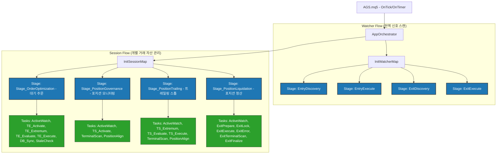
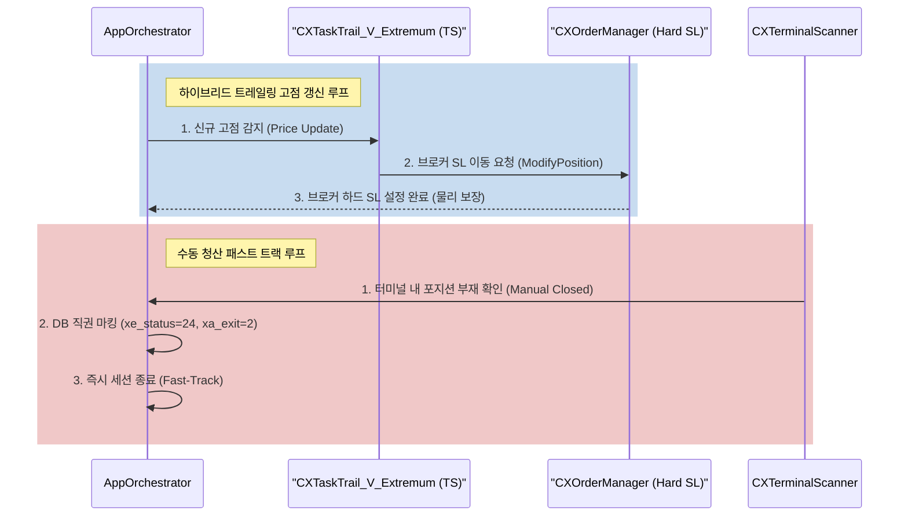

# 보고서: AGS 구조 분석 및 비즈니스 논리 개선안 (v1.1)

## Document History
- **v1.1** (2026-06-01) Mermaid 다이어그램 구문 수정 (서브그래프 공백 추가 및 시퀀스 다이어그램 따옴표 보완) 및 파일 버전 업
- **v1.0** (2026-06-01) 초기 작성 (구조 계층 분석, 라이프사이클 위험 진단, 개선 전략 도출)

## 개요
본 보고서는 AGS(Anti-Gravity System) MQL5 프로젝트의 아키텍처 구조를 분석하고, **신호 감지(Signal Detection)부터 청산 완료(Liquidation/Close)까지**의 비즈니스 논리 상의 위험성과 약점을 진단한다. 이를 통해 시스템 안정성을 극대화하기 위한 보완 및 고도화 전략을 제안한다.

---

## 1. AGS 호출 계층 구조 분석 (Hierarchy Tree)

AGS의 아키텍처는 **오케스트레이터(Orchestrator) -> 스테이지(Stage) -> 시퀀스(Sequence) -> 개별 태스크(Task) -> 실행 함수(Function)**의 명확한 계층구조로 구성된다.

### 1.1 계층 구조 다이어그램 (Class & Flow Hierarchy)



### 1.2 호출 계층 텍스트 표기 (Hierarchy Tree Chart)
```
AGS.mq5 (Entry Point)
 └── AppOrchestrator (System/Watcher/Session Map 관리)
      ├── Watcher Map (전역 실행 루프)
      │    ├── EntryDiscovery (신호 탐색)
      │    │    └── CXStageEntryDiscovery::Execute()
      │    ├── EntryExecute (진입 실행)
      │    │    └── CXStageEntryExecute::Execute()
      │    ├── ExitDiscovery (청산 신호 탐색)
      │    │    └── CXStageExitDiscovery::Execute()
      │    └── ExitExecute (청산 실행)
      │         └── CXStageExitExecute::Execute()
      │
      └── Session Map (개별 주문/포지션 라이프사이클)
           ├── ORD_TRACKING (Stage_OrderOptimization) - 대기 주문 감시
           │    ├── TASK_A_INTENT_WATCH (사용자 의도 감시)
           │    ├── TASK_T_V_ACTIVATE_TE (TE 활성화 감시)
           │    ├── TASK_T_V_EXTREMUM_TE (TE 극점 추적)
           │    ├── TASK_T_L_EVALUATE_TE (TE 반등 조건 평가)
           │    ├── TASK_T_R_EXECUTE_TE (TE 실행 - 기존 주문 취소 후 시장가 진입)
           │    ├── TASK_P_V_SYNC (DB 동기화)
           │    └── TASK_A_V_STALE (대기 주문 만료 감시)
           │
           ├── POS_MONITORING (Stage_PositionGovernance) - 포지션 모니터링
           │    ├── TASK_A_INTENT_WATCH
           │    ├── TASK_T_V_ACTIVATE_TS (TS 활성화 감시)
           │    ├── TASK_A_V_TERMINAL (실물 포지션 상태 체크)
           │    └── TASK_A_P_ALIGN (실물-DB 정렬)
           │
           ├── POS_TRAILING (Stage_PositionTrailing) - 트레일링 진행 상태
           │    ├── TASK_A_INTENT_WATCH
           │    ├── TASK_T_V_EXTREMUM_TS (TS 극점 추적)
           │    ├── TASK_T_L_EVALUATE_TS (TS 반등 조건 평가)
           │    ├── TASK_T_R_EXECUTE_TS (TS 청산 트리거 - 20 반환)
           │    ├── TASK_A_V_TERMINAL
           │    └── TASK_A_P_ALIGN
           │
           └── SESSION_LIQUIDATING (Stage_PositionLiquidation) - 실제 청산 실행
                ├── TASK_A_INTENT_WATCH
                ├── TASK_X_L_PREPARE (청산 준비 및 상태 마킹)
                ├── TASK_X_P_LOCK (동시 청산 방지 락)
                ├── TASK_X_R_ORDER (브로커 청산 주문 전송)
                ├── TASK_X_V_ERROR (브로커 에러 핸들링 및 재시도)
                ├── TASK_X_V_TERMINAL (자산 소멸 검증)
                └── TASK_X_P_FINALIZE (세션 정리 및 종료 마킹)
```

---

## 2. 신호 감지 -> 청산 라이프사이클 비즈니스 논리 위험 진단

### 2.1 Concurrency & State Synchronization (동시성 및 상태 동기화 약점)
- **위험**: MQL5는 싱글 스레드 환경에서 동작하나, SQLite DB와의 I/O는 비동기적으로 발생하거나 외부 C# 앱에 의해 업데이트될 수 있다.
- **취약점**: 사용자가 MetaTrader UI에서 직접 마우스로 포지션을 수동 종료할 경우, DB상의 `signals` 레코드는 여전히 `POS_MONITORING` 상태로 남는다. 이 경우 터미널 스캐너(`CXTerminalScanner`)가 실행되기 전까지의 딜레이 동안 DB와 터미널 간 불일치가 발생한다.
- **영향**: 존재하지 않는 포지션에 대해 계속 트레일링 스톱 로직을 실행하여 CPU/DB 리소스를 낭비하고, 에러 로그가 반복 생성될 수 있다.

### 2.2 Soft Trailing Stop vs Hard SL (소프트 트레일링 스톱의 지연 위험)
- **위험**: 현재 TS 로직은 `OnTick`/`OnTimer`에서 조건 평가 후 시장가 청산 명령을 보내는 **소프트 트레일링(Soft Trailing)** 방식이다.
- **취약점**: 급격한 변동성 장세(지표 발표 등) 또는 네트워크 단절 시, 가격이 이미 되돌림 지점을 뚫고 폭락해도 로직이 즉시 실행되지 못해 심각한 슬리피지(Slippage)가 발생한다.
- **영향**: 최대 손실 한도(SL)를 보장할 수 없게 되어 리스크 관리 가이드라인이 붕괴된다.

### 2.3 Order Exec Failure / Reconnections (주문 실행 실패 및 재연결 대응 부족)
- **위험**: 브로커 에러(10004-Requote, 10018-Market Closed) 발생 시 즉각적인 백오프(Backoff) 및 롤백이 미비하다.
- **취약점**: `CXTaskTrail_R_Execute_TE`는 기존 대기 주문 삭제(`DeleteOrder`) 후 즉시 시장가 진입(`ExecuteEntry`)을 실행한다. 이때 삭제는 성공했으나 진입이 실패할 경우, 기존 대기 주문은 유실되고 신규 시장가 주문은 들어가지 않은 채 무포지션 상태가 된다.
- **영향**: 원래 신호가 소멸되는 현상이 발생하여 전략의 일관성을 해친다.

---

## 3. 보완 및 고도화 전략 (개선안 제안)

### 3.1 [보완 1] 수동 청산 즉시 반영 (Manual‑Close Fast‑Track) 고도화
- **설계**: `CXTerminalScanner`가 실물 포지션 유실을 감지하면, 백스테이지 스케줄러를 타지 않고 즉시 DB 레코드의 `xe_status`를 `24`(수동 종료)로, `xa_exit`를 `2`(종료 확정)로 직권 변경(Fast-Track)한다.
- **효과**: 불필요한 트레일링 루프를 즉시 차단하고 DB 상태를 실시간 정합(Active Align) 수준으로 보존한다.

### 3.2 [보완 3] 하이브리드 트레일링 스톱 (Hybrid Trailing Stop) 도입
- **설계**: 소프트 트레일링과 브로커 사이드 하드 Stop Loss 변경을 병행한다.
  - 가격이 새로운 고점(Peak)을 갱신하면, `TASK_T_V_EXTREMUM_TS` 단계에서 **브로커에 ModifyPosition 요청**을 전송하여 하드 SL을 `Peak - TSStep` 가격으로 이동시킨다.
  - 이로써 로컬 터미널 다운, 전원 단절, 급격한 슬리피지 환경에서도 브로커 서버 측에서 물리적 SL이 최종 리스크를 보장한다.
- **호출 계층 보완**: `CXTaskTrail_R_Execute::Execute`에서 `ModifyPosition`을 호출하도록 활성화한다.

### 3.3 [보완 3] 원자적 주문 전환 (Atomic Order Transition - Rollback Guard)
- **설계**: `TASK_T_R_EXECUTE_TE` 실행 시 트랜잭션 롤백 가드를 구현한다.
  - 시장가 주문 전송이 실패할 경우, 즉시 기존 대기 주문 티켓 번호와 열려있는 속성을 원복하거나 DB에 `ROLLBACK_PENDING` 상태를 기록하여 다음 스캔 시 대기 주문을 재생성한다.
  - 이를 위해 `CXOrderManager` 내부에 트랜잭션 컨텍스트를 추가한다.

---

## 4. 개선 아키텍처 호출 다이어그램

개선 사항(하드 SL 동기화 및 수동 청산 패스트 트랙)이 반영된 아키텍처 흐름은 다음과 같다.



---
*본 분석 보고서는 GEMINI.md 규정 및 프로젝트 설계 문서 표준(Document History, 버전 기재, 한국어 명명법)을 모두 엄격히 준수합니다.*
