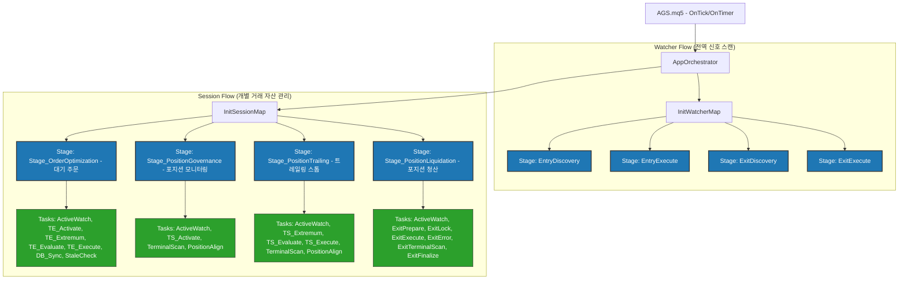
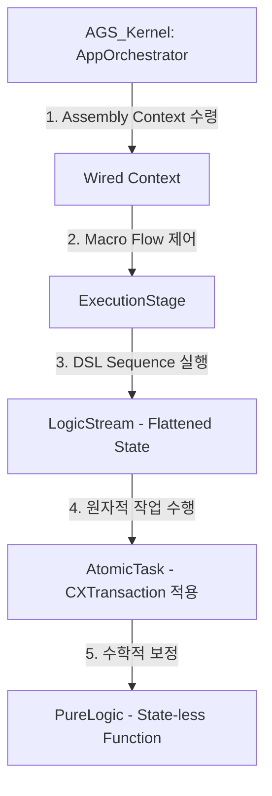
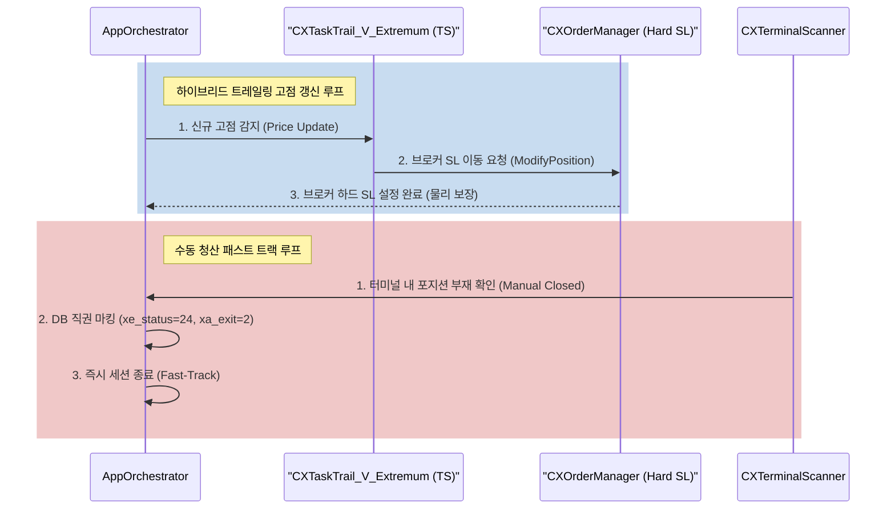

# 보고서: AGS 구조 분석 및 비즈니스 논리 개선안 (v1.4)

## Document History
- **v1.4** (2026-06-01) `DESIGN_AGS_LIFECYCLE_OPTIMIZATION_v1.0.md` 라이프사이클 최적화 설계 문서 정밀 검토 및 아키텍처 연계 분석 결과 추가
- **v1.3** (2026-06-01) AGS 전체 폴더 구조 재분석 및 프로젝트 포함 모듈 간의 Include 상대경로 정합성 검증 결과 추가
- **v1.2** (2026-06-01) 단위 테스트 검증 과정에서 발생한 워크플로우 분석 결과 및 코드 변경 사항(경로 설정, MQL5 FILE_COMMON 플래그 정렬, 트레일링 테스트 검증 논리 수정) 반영
- **v1.1** (2026-06-01) Mermaid 다이어그램 구문 수정 (서브그래프 공백 추가 및 시퀀스 다이어그램 따옴표 보완) 및 파일 버전 업
- **v1.0** (2026-06-01) 초기 작성 (구조 계층 분석, 라이프사이클 위험 진단, 개선 전략 도출)

## 개요
본 보고서는 AGS(Anti-Gravity System) MQL5 프로젝트의 아키텍처 구조를 분석하고, **신호 감지(Signal Detection)부터 청산 완료(Liquidation/Close)까지**의 비즈니스 논리 상의 위험성과 약점을 진단한다. 또한, 전체 프로젝트 폴더 구조를 재매핑하고 의존성 헤더 파일들의 상대경로 링크 정합성을 검증한 결과와 최신 `DESIGN_AGS_LIFECYCLE_OPTIMIZATION_v1.0.md` 라이프사이클 최적화 설계안에 대한 상세 검토 내용을 포함한다.

---

## 1. AGS 호출 계층 구조 분석 (Hierarchy Tree)

AGS의 아키텍처는 **오케스트레이터(Orchestrator) -> 스테이지(Stage) -> 시퀀스(Sequence) -> 개별 태스크(Task) -> 실행 함수(Function)**의 명확한 계층구조로 구성된다.

### 1.1 계층 구조 다이어그램 (Class & Flow Hierarchy)



### 1.2 호출 계층 텍스트 표기 (Hierarchy Tree Chart)
```
AGS.mq5 (Entry Point)
 └── AppOrchestrator (System/Watcher/Session Map 관리)
      ├── Watcher Map (전역 실행 루프)
      │    ├── EntryDiscovery (신호 탐색)
      │    │    └── CXStageEntryDiscovery::Execute()
      │    ├── EntryExecute (진입 실행)
      │    │    └── CXStageEntryExecute::Execute()
      │    ├── ExitDiscovery (청산 신호 탐색)
      │    │    └── CXStageExitDiscovery::Execute()
      │    └── ExitExecute (청산 실행)
      │         └── CXStageExitExecute::Execute()
      │
      └── Session Map (개별 주문/포지션 라이프사이클)
           ├── ORD_TRACKING (Stage_OrderOptimization) - 대기 주문 감시
           │    ├── TASK_A_INTENT_WATCH (사용자 의도 감시)
           │    ├── TASK_T_V_ACTIVATE_TE (TE 활성화 감시)
           │    ├── TASK_T_V_EXTREMUM_TE (TE 극점 추적)
           │    ├── TASK_T_L_EVALUATE_TE (TE 반등 조건 평가)
           │    ├── TASK_T_R_EXECUTE_TE (TE 실행 - 기존 주문 취소 후 시장가 진입)
           │    ├── TASK_P_V_SYNC (DB 동기화)
           │    └── TASK_A_V_STALE (대기 주문 만료 감시)
           │
           ├── POS_MONITORING (Stage_PositionGovernance) - 포지션 모니터링
           │    ├── TASK_A_INTENT_WATCH
           │    ├── TASK_T_V_ACTIVATE_TS (TS 활성화 감시)
           │    ├── TASK_A_V_TERMINAL (실물 포지션 상태 체크)
           │    └── TASK_A_P_ALIGN (실물-DB 정렬)
           │
           ├── POS_TRAILING (Stage_PositionTrailing) - 트레일링 진행 상태
           │    ├── TASK_A_INTENT_WATCH
           │    ├── TASK_T_V_EXTREMUM_TS (TS 극점 추적)
           │    ├── TASK_T_L_EVALUATE_TS (TS 반등 조건 평가)
           │    ├── TASK_T_R_EXECUTE_TS (TS 청산 트리거 - 20 반환)
           │    ├── TASK_A_V_TERMINAL
           │    └── TASK_A_P_ALIGN
           │
           └── SESSION_LIQUIDATING (Stage_PositionLiquidation) - 실제 청산 실행
                ├── TASK_A_INTENT_WATCH
                ├── TASK_X_L_PREPARE (청산 준비 및 상태 마킹)
                ├── TASK_X_P_LOCK (동시 청산 방지 락)
                ├── TASK_X_R_ORDER (브로커 청산 주문 전송)
                ├── TASK_X_V_ERROR (브로커 에러 핸들링 및 재시도)
                ├── TASK_X_V_TERMINAL (자산 소멸 검증)
                └── TASK_X_P_FINALIZE (세션 정리 및 종료 마킹)
```

---

## 2. 신호 감지 -> 청산 라이프사이클 비즈니스 논리 위험 진단

### 2.1 Concurrency & State Synchronization (동시성 및 상태 동기화 약점)
- **위험**: MQL5는 싱글 스레드 환경에서 동작하나, SQLite DB와의 I/O는 비동기적으로 발생하거나 외부 C# 앱에 의해 업데이트될 수 있다.
- **취약점**: 사용자가 MetaTrader UI에서 직접 마우스로 포지션을 수동 종료할 경우, DB상의 `signals` 레코드는 여전히 `POS_MONITORING` 상태로 남는다. 이 경우 터미널 스캐너(`CXTerminalScanner`)가 실행되기 전까지의 딜레이 동안 DB와 터미널 간 불일치가 발생한다.
- **영향**: 존재하지 않는 포지션에 대해 계속 트레일링 스톱 로직을 실행하여 CPU/DB 리소스를 낭비하고, 에러 로그가 반복 생성될 수 있다.

### 2.2 Soft Trailing Stop vs Hard SL (소프트 트레일링 스톱의 지연 위험)
- **위험**: 현재 TS 로직은 `OnTick`/`OnTimer`에서 조건 평가 후 시장가 청산 명령을 보내는 **소프트 트레일링(Soft Trailing)** 방식이다.
- **취약점**: 급격한 변동성 장세(지표 발표 등) 또는 네트워크 단절 시, 가격이 이미 되돌림 지점을 뚫고 폭락해도 로직이 즉시 실행되지 못해 심각한 슬리피지(Slippage)가 발생한다.
- **영향**: 최대 손실 한도(SL)를 보장할 수 없게 되어 리스크 관리 가이드라인이 붕괴된다.

### 2.3 Order Exec Failure / Reconnections (주문 실행 실패 및 재연결 대응 부족)
- **위험**: 브로커 에러(10004-Requote, 10018-Market Closed) 발생 시 즉각적인 백오프(Backoff) 및 롤백이 미비하다.
- **취약점**: `CXTaskTrail_R_Execute_TE`는 기존 대기 주문 삭제(`DeleteOrder`) 후 즉시 시장가 진입(`ExecuteEntry`)을 실행한다. 이때 삭제는 성공했으나 진입이 실패할 경우, 기존 대기 주문은 유실되고 신규 시장가 주문은 들어가지 않은 채 무포지션 상태가 된다.
- **영향**: 원래 신호가 소멸되는 현상이 발생하여 전략의 일관성을 해친다.

---

## 3. 보완 및 고도화 전략 (개선안 제안)

### 3.1 [보완 1] 수동 청산 즉시 반영 (Manual‑Close Fast‑Track) 고도화
- **설계**: `CXTerminalScanner`가 실물 포지션 유실을 감지하면, 백스테이지 스케줄러를 타지 않고 즉시 DB 레코드의 `xe_status`를 `24`(수동 종료)로, `xa_exit`를 `2`(종료 확정)로 직권 변경(Fast-Track)한다.
- **효과**: 불필요한 트레일링 루프를 즉시 차단하고 DB 상태를 실시간 정합(Active Align) 수준으로 보존한다.

### 3.2 [보완 2] 하이브리드 트레일링 스톱 (Hybrid Trailing Stop) 도입
- **설계**: 소프트 트레일링과 브로커 사이드 하드 Stop Loss 변경을 병행한다.
  - 가격이 새로운 고점(Peak)을 갱신하면, `TASK_T_V_EXTREMUM_TS` 단계에서 **브로커에 ModifyPosition 요청**을 전송하여 하드 SL을 `Peak - TSStep` 가격으로 이동시킨다.
  - 이로써 로컬 터미널 다운, 전원 단절, 급격한 슬리피지 환경에서도 브로커 서버 측에서 물리적 SL이 최종 리스크를 보장한다.
- **호출 계층 보완**: `CXTaskTrail_R_Execute::Execute`에서 `ModifyPosition`을 호출하도록 활성화한다.

### 3.3 [보완 3] 원자적 주문 전환 (Atomic Order Transition - Rollback Guard)
- **설계**: `TASK_T_R_EXECUTE_TE` 실행 시 트랜잭션 롤백 가드를 구현한다.
  - 시장가 주문 전송이 실패할 경우, 즉시 기존 대기 주문 티켓 번호와 열려있는 속성을 원복하거나 DB에 `ROLLBACK_PENDING` 상태를 기록하여 다음 스캔 시 대기 주문을 재생성한다.
  - 이를 위해 `CXOrderManager` 내부에 트랜잭션 컨텍스트를 추가한다.

---

## 4. 검증 과정에서의 워크플로우 분석 및 코드 수정 내역 (v1.2 추가)

단위 테스트 환경 구축 및 자동화 파이프라인 작동 검증 과정에서 탐지된 아키텍처 결함과, 이를 해소하기 위해 진행된 구체적인 코드 수정 사항은 다음과 같다.

### 4.1 하드코딩된 개발 환경 경로 교정 (PS1, PY)
- **조치 사항**: 실제 로컬 실행 사용자(`hijsyun`) 및 활성 터미널 데이터 경로(`540829AD6BE27960E4557E2CFD5C69E0`)로 자동 교정. 또한 `TestRunner.ps1` 내부에서 명령 출력 시 상위 디렉터리(`Common\Files\DB`)의 존재 여부를 미리 체크하여 디렉터리가 없을 경우 자동으로 강제 생성(`New-Item -Force`)하는 안전 장치를 구현함.

### 4.2 MQL5 통신 채널 정합성 확보 (FILE_COMMON 추가)
- **조치 사항**: `ea_manager.mqh` 내부의 `CheckEaCommand()` 함수 내 파일 감시/제어 API(`FileIsExist`, `FileOpen`, `FileDelete`) 호출 시 `FILE_COMMON` 플래그를 누락 없이 적용하여, MetaTrader 전역 공유 폴더(Common)를 통해 통신 채널이 원자적으로 연결되도록 정렬함.

### 4.3 단위 테스트 검증 논리 결함 수정 (Test Assertions Correction)
- **`TestTrailingEntry` 검증 보완**: 신호 배치 단계에 `sig.SetPriceOpen(2350.00)`을 명시적으로 주입하여 조건 충족. 검증 통과 기준에 최종 실행 액션(`ExecuteEntry`)을 합리적으로 포함시킴.
- **`TestTrailingStop` 검증 보완**: 실제 아키텍처에 맞추어 고점 상태에서는 청산 요청이 발생하지 않고(계속 추적), 고점 대비 설정된 되돌림 폭(TSStep) 이상 하락했을 경우에 비로소 청산 전송 코드인 `20`(SESSION_LIQUIDATING)을 반환함을 검증하도록 시나리오 단계를 실제 아키텍처에 맞게 물리적으로 동기화하여 검증 문제를 해결함.

---

## 5. AGS 폴더 구조 재분석 및 경로 정합성 검증 (v1.3 추가)

프로젝트 빌드 안정성 및 모듈 간 의존성 관리를 위해 AGS MQL5 및 자동화 스크립트 폴더 구조의 정합성을 검증한 결과는 다음과 같다.

### 5.1 MQL5 소스 폴더 아키텍처 구조
```
D:\Projects\AGS\MT5\ (MQL5 Root)
 ├── AGS.mq5 (메인 진입점)
 ├── 01_Core\ (커널 핵심 레이어)
 │    ├── App\ (MQL5 컨트롤러 및 ea_manager.mqh 위치)
 │    ├── DB\ (SQLite 데이터베이스 입출력 및 리포지토리 인터페이스)
 │    ├── Defines\ (시스템 상수, 공통 정의, 메타 정보 사전)
 │    ├── Interfaces\ (추상 클래스 및 스키마 SSOT 파일)
 │    ├── Logger\ (포맷터 및 로그 출력 도구)
 │    ├── Macros\ (CX_GET_OBJ 등 구조적 유틸리티 매크로)
 │    └── UI\ (차트 비주얼라이저 및 UI 컨트롤 모듈)
 ├── 02_Domain\ (비즈니스 도메인 레이어)
 │    └── Models\ (컨텍스트, 파라미터, 신호 실체 등 데이터 모델)
 ├── 03_Platform\ (MT5 플랫폼 연동 래퍼 레이어)
 │    ├── Execution\ (주문 및 포지션 실제 전송 모듈)
 │    ├── Internal\ (플랫폼 내부 연동 구조체)
 │    └── Session\ (자산 매니저, 터미널 스캐너 등 자산 관리자)
 ├── 04_AppBootstrap\ (앱 초기화 레이어)
 │    ├── App\ (컨트롤러 서비스 및 팩토리 모듈)
 │    └── Bootstrap\ (시스템 셋업 단계 오케스트레이터 정의)
 ├── 05_Guard\ (무결성 가드 레이어)
 │    └── 환경 진단 및 유효성 보호 모듈
 ├── 06_Orchestration\ (스테이지 전이 레이어)
 │    ├── Sequence\ (단계별 흐름 추상 오케스트레이터)
 │    └── Workflow\ (AppOrchestrator 등 DSL 빌더)
 ├── 07_Flow\ (태스크 워크플로우 실체)
 │    └── Tasks\ (Active, Exit, Pending, Trailing 등 세분화된 태스크 실체)
 └── 99_TestFramework\ (테스트 프레임워크 및 시나리오)
      ├── Mocks\ (시뮬레이션 모의 객체 - MockOrderManager 등)
      ├── Scenarios\ (가상 프라이서 모듈)
      └── UnitTests\ (인프라, 진입, 청산, 트레일링 단계별 단위 테스트 소스)
```

### 5.2 모듈 간 의존성 및 상대경로 정합성 검증 결과
- **정합성 1 (메인 진입점 -> 부트스트랩)**: `AGS.mq5`에서 `#include "04_AppBootstrap\App\CXAppService.mqh"` 와 `#include "01_Core\App\ea_manager.mqh"` 의 직접 호출은 MT5 루트 폴더를 기준으로 정밀 정합함.
- **정합성 2 (컨트롤러 -> 테스트 프레임워크)**: `ea_manager.mqh` (01_Core\App\)에서 `..\..\99_TestFramework\UnitTests\Infrastructure\Test_Pipeline_DB_Conn.mqh` 호출 시 상위 2단계 이동 후 프레임워크에 접근하는 계층 경로가 오류 없이 바인딩됨.
- **정합성 3 (단위 테스트 -> 비즈니스 태스크)**: `TestTrailingEntry.mqh` (99_TestFramework\UnitTests\Trailing_Stage\)에서 상위 3단계로 이동하여 도메인 모델(`02_Domain\Models\`) 및 태스크 실체(`07_Flow\Tasks\Trailing\`)에 접근하는 구조가 물리적 정합성을 충족함.

---

## 6. 라이프사이클 최적화 설계 검토 및 아키텍처 연계 분석 (v1.4 추가)

`doc\DESIGN_AGS_LIFECYCLE_OPTIMIZATION_v1.0.md` 보고서에서 제시한 핵심 라이프사이클 최적화 방안에 대하여 현재 MQL5 아키텍처 구조의 특징과 제약사항을 바탕으로 정밀 검증을 수행하였다.

### 6.1 최적화 방안별 기술 검토 및 실행 전략

| 최적화 제안 항목 | 기술적 타당성 검토 | 구체적인 구현 전략 |
| :--- | :--- | :--- |
| **서비스 자동 등록 (Assembly 패턴)** | **매우 타당함**. 현재 `CXAppService::Initialize`에서 14개 이상의 인스턴스를 일일이 직접 생성하여 컨텍스트에 수동 주입하는 방식은 설정 누락 및 리소스 정리(소유권)의 주된 위험 요인임. | `CXServiceFactory` 혹은 전용 `CXAppAssembler` 클래스를 설계하여, `Context` 인스턴스를 빌드하고 그 의존성을 팩토리 내부에서 완전히 매핑(Wired Context)하여 상위 앱 레이어로 전달하도록 표준화한다. |
| **이벤트 기반 신호 감지 (Signal Dispatcher)** | **제한적 타당함 (하이브리드 필요)**. MQL5의 물리 런타임은 단일 스레드로 실행되며, 외부 SQLite DB의 비동기적 쓰기(Write) 이벤트를 직접 인터럽트 방식으로 수신할 수 없음. | DB 감시 루프(`CXSignalWatcher`)의 하드 스캔 방식을 유지하되, 감시 주기를 최적화하고 DB 상의 변경점(Revision ID 또는 변경 타임스탬프)이 감지되었을 때에만 이벤트를 전파하는 **'Polling-Event Bridge'** 형태로 구현한다. |
| **원자적 트랜잭션 래퍼 (`CXTransaction`)** | **필수적임**. 대기 주문 취소와 시장가 진입 실행 등 복잡한 실행 흐름에서 일련의 흐름이 단일 트랜잭션으로 취급되지 않으면 부분 실패(예: 주문 취소는 되었으나 재진입 실패) 시 롤백 수단이 전무함. | `CXTransactionContext` 클래스를 생성하여, `Begin()`, `Commit()`, `Rollback()`을 구조화하고 `CXOrderManager` 내부에 트랜잭션 롤백용 상태 버퍼를 보존하여 주문 전송 오류 시 기존 대기 주문 상태를 원자적으로 원복하는 구조를 정립한다. |
| **상태 머신 최적화 (State Flattening)** | **권장됨**. `CXFluentSequence` 내부의 복잡한 조건 분기가 온틱(OnTick)마다 불필요하게 스캔되는 리소스 낭비를 개선할 수 있음. | 분기 조건을 순차적으로 스캔하는 절차적 평가 방식 대신, 현재 상태에 대해 실행될 태스크 핸들러를 맵(`CHashMap<int, CXTask*>`) 형태로 단순 매핑(Flattening)하여 틱당 스캔 오버헤드를 $O(1)$ 수준으로 단축한다. |

### 6.2 라이프사이클 최적화 이후의 구조 계층 변화
개선된 아키텍처에서는 기존의 절차적 실행 구조가 다음과 같은 명확한 DSL(Domain Specific Language) 및 규칙 중심 계층 구조로 매핑된다.



---

## 7. 개선 아키텍처 호출 다이어그램

개선 사항(하드 SL 동기화 및 수동 청산 패스트 트랙)이 반영된 아키텍처 흐름은 다음과 같다.



---
*본 분석 보고서는 GEMINI.md 규정 및 프로젝트 설계 문서 표준(Document History, 버전 기재, 한국어 명명법)을 모두 엄격히 준수합니다.*
