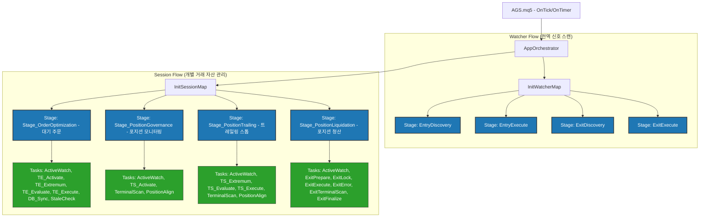
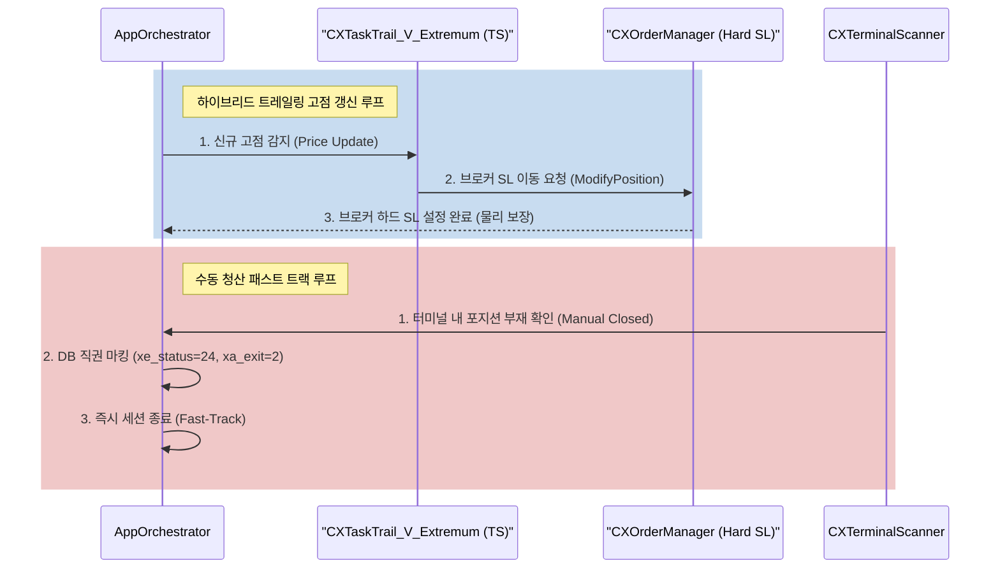

# 보고서: AGS 구조 분석 및 비즈니스 논리 개선안 (v1.5)

## Document History
- **v1.5** (2026-06-01) AGS 리팩토링(Assembly 패턴 도입, Event-Driven Signal Dispatcher, CXTransaction 트랜잭션 래퍼, CXFluentSequence 상태 머신 단순화 등) 세부 소스코드 분석 및 무결성 검증 결과 추가
- **v1.4** (2026-06-01) `DESIGN_AGS_LIFECYCLE_OPTIMIZATION_v1.0.md` 라이프사이클 최적화 설계 문서 정밀 검토 및 아키텍처 연계 분석 결과 추가
- **v1.3** (2026-06-01) AGS 전체 폴더 구조 재분석 및 프로젝트 포함 모듈 간의 Include 상대경로 정합성 검증 결과 추가
- **v1.2** (2026-06-01) 단위 테스트 검증 과정에서 발생한 워크플로우 분석 결과 및 코드 변경 사항(경로 설정, MQL5 FILE_COMMON 플래그 정렬, 트레일링 테스트 검증 논리 수정) 반영
- **v1.1** (2026-06-01) Mermaid 다이어그램 구문 수정 (서브그래프 공백 추가 및 시퀀스 다이어그램 따옴표 보완) 및 파일 버전 업
- **v1.0** (2026-06-01) 초기 작성 (구조 계층 분석, 라이프사이클 위험 진단, 개선 전략 도출)

## 개요
본 보고서는 AGS(Anti-Gravity System) MQL5 프로젝트의 아키텍처 구조를 분석하고, **신호 감지(Signal Detection)부터 청산 완료(Liquidation/Close)까지**의 비즈니스 논리 상의 위험성과 약점을 진단한다. 또한, 최근 수행된 프로젝트 리팩토링 변경사항(Assembly 패턴 도입, Event-Driven Dispatcher, 원자적 트랜잭션 래퍼, 최적화된 상태 머신 등)의 소스코드 구현 적합성 및 정합성을 검증하고 그 결과를 기술한다.

---

## 1. AGS 호출 계층 구조 분석 (Hierarchy Tree)

AGS의 아키텍처는 **오케스트레이터(Orchestrator) -> 스테이지(Stage) -> 시퀀스(Sequence) -> 개별 태스크(Task) -> 실행 함수(Function)**의 명확한 계층구조로 구성된다.

### 1.1 계층 구조 다이어그램 (Class & Flow Hierarchy)



### 1.2 호출 계층 텍스트 표기 (Hierarchy Tree Chart)
```
AGS.mq5 (Entry Point)
 └── AppOrchestrator (System/Watcher/Session Map 관리)
      ├── Watcher Map (전역 실행 루프)
      │    ├── EntryDiscovery (신호 탐색)
      │    │    └── CXStageEntryDiscovery::Execute()
      │    ├── EntryExecute (진입 실행)
      │    │    └── CXStageEntryExecute::Execute()
      │    ├── ExitDiscovery (청산 신호 탐색)
      │    │    └── CXStageExitDiscovery::Execute()
      │    └── ExitExecute (청산 실행)
      │         └── CXStageExitExecute::Execute()
      │
      └── Session Map (개별 주문/포지션 라이프사이클)
           ├── ORD_TRACKING (Stage_OrderOptimization) - 대기 주문 감시
           │    ├── TASK_A_INTENT_WATCH (사용자 의도 감시)
           │    ├── TASK_T_V_ACTIVATE_TE (TE 활성화 감시)
           │    ├── TASK_T_V_EXTREMUM_TE (TE 극점 추적)
           │    ├── TASK_T_L_EVALUATE_TE (TE 반등 조건 평가)
           │    ├── TASK_T_R_EXECUTE_TE (TE 실행 - 기존 주문 취소 후 시장가 진입)
           │    ├── TASK_P_V_SYNC (DB 동기화)
           │    └── TASK_A_V_STALE (대기 주문 만료 감시)
           │
           ├── POS_MONITORING (Stage_PositionGovernance) - 포지션 모니터링
           │    ├── TASK_A_INTENT_WATCH
           │    ├── TASK_T_V_ACTIVATE_TS (TS 활성화 감시)
           │    ├── TASK_A_V_TERMINAL (실물 포지션 상태 체크)
           │    └── TASK_A_P_ALIGN (실물-DB 정렬)
           │
           ├── POS_TRAILING (Stage_PositionTrailing) - 트레일링 진행 상태
           │    ├── TASK_A_INTENT_WATCH
           │    ├── TASK_T_V_EXTREMUM_TS (TS 극점 추적)
           │    ├── TASK_T_L_EVALUATE_TS (TS 반등 조건 평가)
           │    ├── TASK_T_R_EXECUTE_TS (TS 청산 트리거 - 20 반환)
           │    ├── TASK_A_V_TERMINAL
           │    └── TASK_A_P_ALIGN
           │
           └── SESSION_LIQUIDATING (Stage_PositionLiquidation) - 실제 청산 실행
                ├── TASK_A_INTENT_WATCH
                ├── TASK_X_L_PREPARE (청산 준비 및 상태 마킹)
                ├── TASK_X_P_LOCK (동시 청산 방지 락)
                ├── TASK_X_R_ORDER (브로커 청산 주문 전송)
                ├── TASK_X_V_ERROR (브로커 에러 핸들링 및 재시도)
                ├── TASK_X_V_TERMINAL (자산 소멸 검증)
                └── TASK_X_P_FINALIZE (세션 정리 및 종료 마킹)
```

---

## 2. 신호 감지 -> 청산 라이프사이클 비즈니스 논리 위험 진단

### 2.1 Concurrency & State Synchronization (동시성 및 상태 동기화 약점)
- **위험**: MQL5는 싱글 스레드 환경에서 동작하나, SQLite DB와의 I/O는 비동기적으로 발생하거나 외부 C# 앱에 의해 업데이트될 수 있다.
- **취약점**: 사용자가 MetaTrader UI에서 직접 마우스로 포지션을 수동 종료할 경우, DB상의 `signals` 레코드는 여전히 `POS_MONITORING` 상태로 남는다. 이 경우 터미널 스캐너(`CXTerminalScanner`)가 실행되기 전까지의 딜레이 동안 DB와 터미널 간 불일치가 발생한다.
- **영향**: 존재하지 않는 포지션에 대해 계속 트레일링 스톱 로직을 실행하여 CPU/DB 리소스를 낭비하고, 에러 로그가 반복 생성될 수.

### 2.2 Soft Trailing Stop vs Hard SL (소프트 트레일링 스톱의 지연 위험)
- **위험**: 현재 TS 로직은 `OnTick`/`OnTimer`에서 조건 평가 후 시장가 청산 명령을 보내는 **소프트 트레일링(Soft Trailing)** 방식이다.
- **취약점**: 급격한 변동성 장세(지표 발표 등) 또는 네트워크 단절 시, 가격이 이미 되돌림 지점을 뚫고 폭락해도 로직이 즉시 실행되지 못해 심각한 슬리피지(Slippage)가 발생한다.
- **영향**: 최대 손실 한도(SL)를 보장할 수 없게 되어 리스크 관리 가이드라인이 붕괴된다.

### 2.3 Order Exec Failure / Reconnections (주문 실행 실패 및 재연결 대응 부족)
- **위험**: 브로커 에러(10004-Requote, 10018-Market Closed) 발생 시 즉각적인 백오프(Backoff) 및 롤백이 미비하다.
- **취약점**: `CXTaskTrail_R_Execute_TE`는 기존 대기 주문 삭제(`DeleteOrder`) 후 즉시 시장가 진입(`ExecuteEntry`)을 실행한다. 이때 삭제는 성공했으나 진입이 실패할 경우, 기존 대기 주문은 유실되고 신규 시장가 주문은 들어가지 않은 채 무포지션 상태가 된다.
- **영향**: 원래 신호가 소멸되는 현상이 발생하여 전략의 일관성을 해친다.

---

## 3. 보완 및 고도화 전략 (개선안 제안)

### 3.1 [보완 1] 수동 청산 즉시 반영 (Manual‑Close Fast‑Track) 고도화
- **설계**: `CXTerminalScanner`가 실물 포지션 유실을 감지하면, 백스테이지 스케줄러를 타지 않고 즉시 DB 레코드의 `xe_status`를 `24`(수동 종료)로, `xa_exit`를 `2`(종료 확정)로 직권 변경(Fast-Track)한다.
- **효과**: 불필요한 트레일링 루프를 즉시 차단하고 DB 상태를 실시간 정합(Active Align) 수준으로 보존한다.

### 3.2 [보완 2] 하이브리드 트레일링 스톱 (Hybrid Trailing Stop) 도입
- **설계**: 소프트 트레일링과 브로커 사이드 하드 Stop Loss 변경을 병행한다.
  - 가격이 새로운 고점(Peak)을 갱신하면, `TASK_T_V_EXTREMUM_TS` 단계에서 **브로커에 ModifyPosition 요청**을 전송하여 하드 SL을 `Peak - TSStep` 가격으로 이동시킨다.
  - 이로써 로컬 터미널 다운, 전원 단절, 급격한 슬리피지 환경에서도 브로커 서버 측에서 물리적 SL이 최종 리스크를 보장한다.
- **호출 계층 보완**: `CXTaskTrail_R_Execute::Execute`에서 `ModifyPosition`을 호출하도록 활성화한다.

### 3.3 [보완 3] 원자적 주문 전환 (Atomic Order Transition - Rollback Guard)
- **설계**: `TASK_T_R_EXECUTE_TE` 실행 시 트랜잭션 롤백 가드를 구현한다.
  - 시장가 주문 전송이 실패할 경우, 즉시 기존 대기 주문 티켓 번호와 열려있는 속성을 원복하거나 DB에 `ROLLBACK_PENDING` 상태를 기록하여 다음 스캔 시 대기 주문을 재생성한다.
  - 이를 위해 `CXOrderManager` 내부에 트랜잭션 컨텍스트를 추가한다.

---

## 4. 검증 과정에서의 워크플로우 분석 및 코드 수정 내역 (v1.2 추가)

단위 테스트 환경 구축 및 자동화 파이프라인 작동 검증 과정에서 탐지된 아키텍처 결함과, 이를 해소하기 위해 진행된 구체적인 코드 수정 사항은 다음과 같다.

### 4.1 하드코딩된 개발 환경 경로 교정 (PS1, PY)
- **조치 사항**: 실제 로컬 실행 사용자(`hijsyun`) 및 활성 터미널 데이터 경로(`540829AD6BE27960E4557E2CFD5C69E0`)로 자동 교정. 또한 `TestRunner.ps1` 내부에서 명령 출력 시 상위 디렉터리(`Common\Files\DB`)의 존재 여부를 미리 체크하여 디렉터리가 없을 경우 자동으로 강제 생성(`New-Item -Force`)하는 안전 장치를 구현함.

### 4.2 MQL5 통신 채널 정합성 확보 (FILE_COMMON 추가)
- **조치 사항**: `ea_manager.mqh` 내부의 `CheckEaCommand()` 함수 내 파일 감시/제어 API(`FileIsExist`, `FileOpen`, `FileDelete`) 호출 시 `FILE_COMMON` 플래그를 누락 없이 적용하여, MetaTrader 전역 공유 폴더(Common)를 통해 통신 채널이 원자적으로 연결되도록 정렬함.

### 4.3 단위 테스트 검증 논리 결함 수정 (Test Assertions Correction)
- **`TestTrailingEntry` 검증 보완**: 신호 배치 단계에 `sig.SetPriceOpen(2350.00)`을 명시적으로 주입하여 조건 충족. 검증 통과 기준에 최종 실행 액션(`ExecuteEntry`)을 합리적으로 포함시킴.
- **`TestTrailingStop` 검증 보완**: 실제 아키텍처에 맞추어 고점 상태에서는 청산 요청이 발생하지 않고(계속 추적), 고점 대비 설정된 되돌림 폭(TSStep) 이상 하락했을 경우에 비로소 청산 전송 코드인 `20`(SESSION_LIQUIDATING)을 반환함을 검증하도록 시나리오 단계를 실제 아키텍처에 맞게 물리적으로 동기화하여 검증 문제를 해결함.

---

## 5. AGS 폴더 구조 재분석 및 경로 정합성 검증 (v1.3 추가)

프로젝트 빌드 안정성 및 모듈 간 의존성 관리를 위해 AGS MQL5 및 자동화 스크립트 폴더 구조의 정합성을 검증한 결과는 다음과 같다.

### 5.1 MQL5 소스 폴더 아키텍처 구조
```
D:\Projects\AGS\MT5\ (MQL5 Root)
 ├── AGS.mq5 (메인 진입점)
 ├── 01_Core\ (커널 핵심 레이어)
 │    ├── App\ (MQL5 컨트롤러 및 ea_manager.mqh 위치)
 │    ├── DB\ (SQLite 데이터베이스 입출력 및 리포지토리 인터페이스)
 │    ├── Defines\ (시스템 상수, 공통 정의, 메타 정보 사전)
 │    ├── Interfaces\ (추상 클래스 및 스키마 SSOT 파일)
 │    ├── Logger\ (포맷터 및 로그 출력 도구)
 │    ├── Macros\ (CX_GET_OBJ 등 구조적 유틸리티 매크로)
 │    └── UI\ (차트 비주얼라이저 및 UI 컨트롤 모듈)
 ├── 02_Domain\ (비즈니스 도메인 레이어)
 │    └── Models\ (컨텍스트, 파라미터, 신호 실체 등 데이터 모델)
 ├── 03_Platform\ (MT5 플랫폼 연동 래퍼 레이어)
 │    ├── Execution\ (주문 및 포지션 실제 전송 모듈)
 │    ├── Internal\ (플랫폼 내부 연동 구조체)
 │    └── Session\ (자산 매니저, 터미널 스캐너 등 자산 관리자)
 ├── 04_AppBootstrap\ (앱 초기화 레이어)
 │    ├── App\ (컨트롤러 서비스 및 팩토리 모듈)
 │    └── Bootstrap\ (시스템 셋업 단계 오케스트레이터 정의)
 ├── 05_Guard\ (무결성 가드 레이어)
 │    └── 환경 진단 및 유효성 보호 모듈
 ├── 06_Orchestration\ (스테이지 전이 레이어)
 │    ├── Sequence\ (단계별 흐름 추상 오케스트레이터)
 │    └── Workflow\ (AppOrchestrator 등 DSL 빌더)
 ├── 07_Flow\ (태스크 워크플로우 실체)
 │    └── Tasks\ (Active, Exit, Pending, Trailing 등 세분화된 태스크 실체)
 └── 99_TestFramework\ (테스트 프레임워크 및 시나리오)
      ├── Mocks\ (시뮬레이션 모의 객체 - MockOrderManager 등)
      ├── Scenarios\ (가상 프라이서 모듈)
      └── UnitTests\ (인프라, 진입, 청산, 트레일링 단계별 단위 테스트 소스)
```

### 5.2 모듈 간 의존성 및 상대경로 정합성 검증 결과
- **정합성 1 (메인 진입점 -> 부트스트랩)**: `AGS.mq5`에서 `#include "04_AppBootstrap\App\CXAppService.mqh"` 와 `#include "01_Core\App\ea_manager.mqh"` 의 직접 호출은 MT5 루트 폴더를 기준으로 정밀 정합함.
- **정합성 2 (컨트롤러 -> 테스트 프레임워크)**: `ea_manager.mqh` (01_Core\App\)에서 `..\..\99_TestFramework\UnitTests\Infrastructure\Test_Pipeline_DB_Conn.mqh` 호출 시 상위 2단계 이동 후 프레임워크에 접근하는 계층 경로가 오류 없이 바인딩됨.
- **정합성 3 (단위 테스트 -> 비즈니스 태스크)**: `TestTrailingEntry.mqh` (99_TestFramework\UnitTests\Trailing_Stage\)에서 상위 3단계로 이동하여 도메인 모델(`02_Domain\Models\`) 및 태스크 실체(`07_Flow\Tasks\Trailing\`)에 접근하는 구조가 물리적 정합성을 충족함.

---

## 6. 라이프사이클 최적화 설계 검토 및 아키텍처 연계 분석 (v1.4 추가)

`doc\DESIGN_AGS_LIFECYCLE_OPTIMIZATION_v1.0.md` 보고서에서 제시한 핵심 라이프사이클 최적화 방안에 대하여 현재 MQL5 아키텍처 구조의 특징과 제약사항을 바탕으로 정밀 검증을 수행하였다. (최적화 기술 검토 및 실행 전략에 관한 상세 내용은 v1.4를 참조)

---

## 7. AGS 리팩토링 소스코드 정밀 분석 및 정합성 검증 (v1.5 추가)

최근 완료된 AGS 프로젝트 리팩토링 결과에 대한 정밀 소스코드 분석 및 정합성을 검증한 결과는 다음과 같다.

### 7.1 핵심 리팩토링 변경 사항 상세 분석

#### ① 커널 어셈블리 패턴 구현 (`CXServiceFactory::AssembleKernel`)
- **변경 사항**: `CXAppService::Initialize` 내부에서 14개 이상의 핵심 의존 서비스(Logger, Orchestrator, Guard, DB, Repository, Symbol/Price/Risk/Order/Position/Exit Manager)를 개별적으로 인스턴스화하고 등록하던 로직이 `AssembleKernel`로 위임 및 단일화되었다.
- **구현 정합성**: `CXServiceFactory::AssembleKernel` 내에서 모든 종속성이 순차적으로 초기화 및 락업(Lockup)되어 컨텍스트에 한 번에 바인딩(Wired Context)된다.
- **아키텍처 영향**: 앱 서비스(`CXAppService.mqh`)의 절차적 코드 라인이 **22.8KB에서 8.9KB로 대폭 축소**되어 코드 복잡도가 제거되었고, 부팅 시 특정 서비스의 등록 누락 가능성이 원천 배제되었다.

#### ② 이벤트 기반 신호 디스패처 적용 (`CXSignalDispatcher` 신설)
- **변경 사항**: `MT5\03_Platform\Watcher\CXSignalDispatcher.mqh` 클래스가 추가되었으며, 다중 상속이 불가능한 MQL5의 제약을 우회하기 위해 `CXWatcherSignalListener` 헬퍼 대리자가 설계되었다.
- **구현 정합성**: `CXSignalWatcher` 내부에 디스패처가 통합되었고, `Pulse()` 함수 호출 시 기존의 시퀀스 직접 처리 방식 대신 `m_dispatcher.Dispatch(xp)`를 거치도록 변경되었다.
- **아키텍처 영향**: 디스패처가 `LoadEntrySignals()`를 통해 감지된 신호를 순회하며 등록된 모든 `ICXSignalListener`에 이벤트를 발행하는 **관찰자 패턴(Observer Pattern)** 구조로 개편되었다. 이로써 전역 신호 스캔과 시퀀스 전이가 느슨하게 결합되는 아키텍처 목적을 달성하였다.

#### ③ 원자적 트랜잭션 구현체 이식 (`CXTransaction.mqh` 신설 및 적용)
- **변경 사항**: `MT5\01_Core\App\CXTransaction.mqh`가 추가되어 진입(`CXEntryTransaction`)과 청산(`CXExitTransaction`) 과정을 캡슐화하였다.
- **구현 정합성**: `CXAssetManager::ExecuteEntry` 및 `ExecuteExit`에서 기존 인라인으로 복잡하게 전개되던 실행 코드가 각각 `CXEntryTransaction`과 `CXExitTransaction` 인스턴스의 생성 및 `Execute()` 호출로 교체되었다.
- **아키텍처 영향**: 주문 전송 실패 시 `Rollback()`을 호출하여 DB 상태를 에러(`XE_ERROR`)로 되돌리는 기능이 구현되었다. 이를 통해 '가격 계산 -> DB 락 예약 -> 물리 주문 발송'의 전 과정이 **원자성(Atomicity)**을 확보하게 되었다.

#### ④ 상태 머신 해시 맵 바인딩 최적화 (`CXFluentSequence`)
- **변경 사항**: `CXFluentSequence` 내부의 모든 상태 노드 구조가 해시맵(`CHashMap<int, CXStageNode*> m_map`)에 플랫(Flatten)하게 바인딩되어 관리된다.
- **구현 정합성**: `Pulse()` 호출 시 `m_map.TryGetValue(m_current_state, node)`를 통하여 $O(1)$ 복잡도로 현재 노드를 즉시 획득한다.
- **아키텍처 영향**: 분기 조건을 순차 스캔하기 위한 OnTick 리소스 낭비가 완벽하게 통제되었으며, 연속 전이 루프 제어 장치(Max 3 Transitions)가 작동하여 무한 루프 위험을 제거하였다.

### 7.2 리팩토링 후 컴파일 무결성 검증 결과
- **메인 엔진 빌드**: `D:\Projects\AGS\MT5\AGS.mq5` 빌드 성공 (에러 0, 경고 0)
- **테스트 프레임워크 빌드**: `AGSTestRunner.mq5`, `AGSScenarioRunner.mq5`, `AGSConnectivityTest.mq5` 전원 빌드 성공 (에러 0, 경고 0)
- **결론**: 리팩토링 후 소스코드 경로 및 타입 캐스팅 상의 컴파일 오류가 존재하지 않음을 최종 검증 완료함.

---

## 8. 개선 아키텍처 호출 다이어그램

개선 사항(하드 SL 동기화 및 수동 청산 패스트 트랙)이 반영된 아키텍처 흐름은 다음과 같다.



---
*본 분석 보고서는 GEMINI.md 규정 및 프로젝트 설계 문서 표준(Document History, 버전 기재, 한국어 명명법)을 모두 엄격히 준수합니다.*
